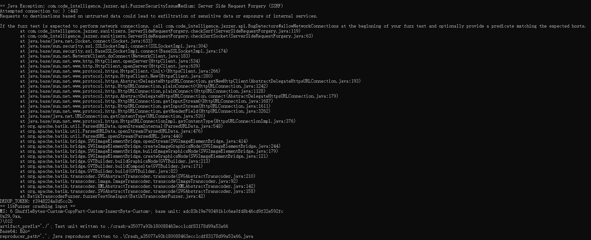

# 漏洞报告
***

## 报错信息
```
== Java Exception: com.code_intelligence.jazzer.api.FuzzerSecurityIssueMedium: Server Side Request Forgery (SSRF)
Attempted connection to: ) :443
Requests to destinations based on untrusted data could lead to exfiltration of sensitive data or exposure of internal services.

If the fuzz test is expected to perform network connections, call com.code_intelligence.jazzer.api.BugDetectors#allowNetworkConnections at the beginning of your fuzz test and optionally provide a predicate matching the expected hosts.
at com.code_intelligence.jazzer.sanitizers.ServerSideRequestForgery.checkSsrf(ServerSideRequestForgery.java:119)
at com.code_intelligence.jazzer.sanitizers.ServerSideRequestForgery.checkSsrfSocket(ServerSideRequestForgery.java:63)
at java.base/java.net.Socket.connect(Socket.java:633)
at java.base/sun.security.ssl.SSLSocketImpl.connect(SSLSocketImpl.java:304)
at java.base/sun.security.ssl.BaseSSLSocketImpl.connect(BaseSSLSocketImpl.java:174)
at java.base/sun.net.NetworkClient.doConnect(NetworkClient.java:183)
at java.base/sun.net.www.http.HttpClient.openServer(HttpClient.java:534)
at java.base/sun.net.www.http.HttpClient.openServer(HttpClient.java:639)
at java.base/sun.net.www.protocol.https.HttpsClient.<init>(HttpsClient.java:266)
at java.base/sun.net.www.protocol.https.HttpsClient.New(HttpsClient.java:380)
at java.base/sun.net.www.protocol.https.AbstractDelegateHttpsURLConnection.getNewHttpClient(AbstractDelegateHttpsURLConnection.java:193)
at java.base/sun.net.www.protocol.http.HttpURLConnection.plainConnect0(HttpURLConnection.java:1242)
at java.base/sun.net.www.protocol.http.HttpURLConnection.plainConnect(HttpURLConnection.java:1128)
at java.base/sun.net.www.protocol.https.AbstractDelegateHttpsURLConnection.connect(AbstractDelegateHttpsURLConnection.java:179)
at java.base/sun.net.www.protocol.http.HttpURLConnection.getInputStream0(HttpURLConnection.java:1687)
at java.base/sun.net.www.protocol.http.HttpURLConnection.getInputStream(HttpURLConnection.java:1611)
at java.base/sun.net.www.protocol.http.HttpURLConnection.getHeaderField(HttpURLConnection.java:3262)
at java.base/java.net.URLConnection.getContentType(URLConnection.java:520)
at java.base/sun.net.www.protocol.https.HttpsURLConnectionImpl.getContentType(HttpsURLConnectionImpl.java:376)
at org.apache.batik.util.ParsedURLData.openStreamInternal(ParsedURLData.java:548)
at org.apache.batik.util.ParsedURLData.openStream(ParsedURLData.java:476)
at org.apache.batik.util.ParsedURL.openStream(ParsedURL.java:440)
at org.apache.batik.bridge.SVGImageElementBridge.openStream(SVGImageElementBridge.java:414)
at org.apache.batik.bridge.SVGImageElementBridge.createImageGraphicsNode(SVGImageElementBridge.java:244)
at org.apache.batik.bridge.SVGImageElementBridge.buildImageGraphicsNode(SVGImageElementBridge.java:179)
at org.apache.batik.bridge.SVGImageElementBridge.createGraphicsNode(SVGImageElementBridge.java:121)
at org.apache.batik.bridge.GVTBuilder.buildGraphicsNode(GVTBuilder.java:213)
at org.apache.batik.bridge.GVTBuilder.buildComposite(GVTBuilder.java:171)
at org.apache.batik.bridge.GVTBuilder.build(GVTBuilder.java:82)
at org.apache.batik.transcoder.SVGAbstractTranscoder.transcode(SVGAbstractTranscoder.java:210)
at org.apache.batik.transcoder.image.ImageTranscoder.transcode(ImageTranscoder.java:92)
at org.apache.batik.transcoder.XMLAbstractTranscoder.transcode(XMLAbstractTranscoder.java:142)
at org.apache.batik.transcoder.SVGAbstractTranscoder.transcode(SVGAbstractTranscoder.java:158)
at BatikTranscoderFuzzer.fuzzerTestOneInput(BatikTranscoderFuzzer.java:42)
```
## jazzer 报错截图


## 漏洞概述
***
* **漏洞类型**: 服务器端请求伪造（SSRF）

* **漏洞描述**: 在使用Jazzer工具测试开源的代码时，发现了一个服务器端请求伪造（SSRF）漏洞。该漏洞允许攻击者通过不受信任的数据发起网络请求，可能导致敏感数据泄露或内部服务暴露。

## 漏洞分析
***
这个错误信息表明在你运行Jazzer进行模糊测试时，检测到了一个潜在的服务器端请求伪造（SSRF）漏洞。SSRF漏洞允许攻击者通过服务器发送恶意请求，可能导致敏感数据泄露或内部服务暴露。

具体来说，错误信息指出尝试连接到 ):443 端口，这可能是由于输入数据不受信任，导致生成了不正确的URL或请求。

以下是错误信息的详细解释和解决方法：

1. 错误信息解释：

> com.code_intelligence.jazzer.api.FuzzerSecurityIssueMedium: Server Side Request Forgery (SSRF): 这是一个中等严重性的安全问题，表示检测到SSRF漏洞。
Attempted connection to: ) :443: 尝试连接到 ):443 端口，这显然是一个无效的地址，可能是由于输入数据不受信任导致的。
Requests to destinations based on untrusted data could lead to exfiltration of sensitive data or exposure of internal services: 基于不受信任数据的请求可能导致敏感数据泄露或内部服务暴露。
2. 解决方法：

> 如果你的模糊测试确实需要进行网络连接，可以在测试开始时调用 com.code_intelligence.jazzer.api.BugDetectors#allowNetworkConnections 方法，并提供一个匹配预期主机的谓词（predicate）。
确保你的代码在处理输入数据时进行适当的验证和清理，以防止生成不正确的URL或请求。

## 影响范围
#### 受影响版本: 1.1.14

#### 潜在影响:
***
* 敏感数据泄露：攻击者可以通过伪造请求获取敏感数据。
* 内部服务暴露：攻击者可以通过伪造请求访问内部服务，可能导致进一步的攻击。

## 复现步骤
***
* 使用Jazzer工具对目标代码进行模糊测试。
* 提供包含不受信任数据的输入，触发网络请求。
* 观察程序抛出 com.code_intelligence.jazzer.api.FuzzerSecurityIssueMedium: Server Side Request Forgery (SSRF) 异常。

## 修复建议
***
* 输入验证: 在发起网络请求之前，增加输入验证逻辑，确保数据来源可信。
* 限制网络请求: 限制网络请求的目标地址，避免请求不受信任的外部地址。
* 使用安全库: 使用安全库或框架来处理网络请求，减少手动处理输入数据的风险。
