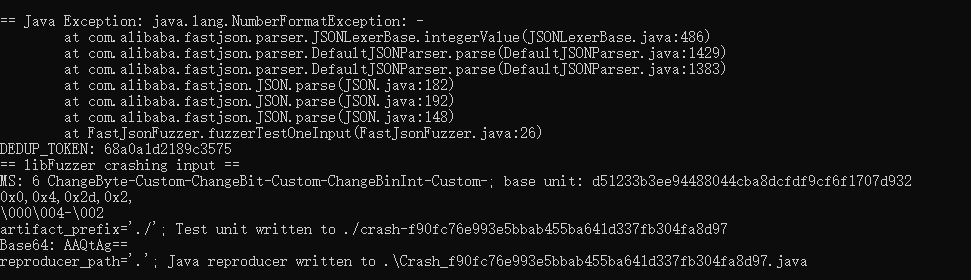

# 漏洞报告
***

## 报错信息
```
== Java Exception: java.lang.NumberFormatException: -
        at com.alibaba.fastjson.parser.JSONLexerBase.integerValue(JSONLexerBase.java:486)
        at com.alibaba.fastjson.parser.DefaultJSONParser.parse(DefaultJSONParser.java:1429)
        at com.alibaba.fastjson.parser.DefaultJSONParser.parse(DefaultJSONParser.java:1383)
        at com.alibaba.fastjson.JSON.parse(JSON.java:182)
        at com.alibaba.fastjson.JSON.parse(JSON.java:192)
        at com.alibaba.fastjson.JSON.parse(JSON.java:148)
        at FastJsonFuzzer.fuzzerTestOneInput(FastJsonFuzzer.java:26)
```
## jazzer 报错截图


## 漏洞概述
***
**漏洞类型:** 输入验证缺陷

**漏洞描述:** 在使用Jazzer工具测试开源的FastJSON库时，发现java.lang.NumberFormatException异常。这表明在解析JSON数据时，输入数据包含非法的数字格式，导致程序抛出异常。

## 异常分析:
***
* java.lang.NumberFormatException: - 表示在解析过程中遇到了非法的数字格式（例如单独的负号）。
* 异常发生在 com.alibaba.fastjson.parser.JSONLexerBase.integerValue 方法中，该方法负责将字符串解析为整数。
* 异常沿着调用栈传播，最终在 FastJsonFuzzer.fuzzerTestOneInput 方法中被捕获。

## 影响范围
#### 受影响版本: 1.2.75

#### 潜在影响:
***
* 程序崩溃：未处理的异常会导致程序崩溃，影响服务的可用性。
* 安全风险：如果攻击者能够控制输入数据，可能会利用该漏洞进行拒绝服务攻击（DoS）。

## 复现步骤
***
* 使用Jazzer工具对FastJSON库进行模糊测试。
* 提供包含非法数字格式（例如单独的负号）的JSON数据。
* 观察程序抛出 java.lang.NumberFormatException 异常。
## 修复建议
***
* 输入验证: 在解析JSON数据之前，增加输入验证逻辑，确保数据格式合法。
* 异常处理: 在解析过程中捕获并处理 NumberFormatException 异常，避免程序崩溃。
* 库更新: 检查FastJSON库的最新版本，查看是否已有相关修复，并考虑升级到最新版本。