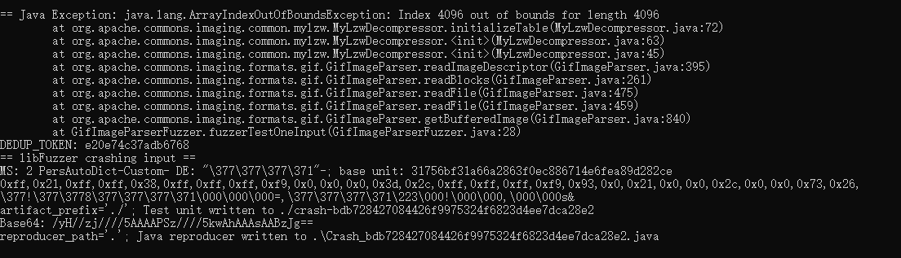

# 漏洞报告
***

## 报错信息
```
== java.lang.ArrayIndexOutOfBoundsException: Index 4096 out of bounds for length 4096
    at org.apache.commons.imaging.common.mylzw.MyLzwDecompressor.initializeTable(MyLzwDecompressor.java:72)
    at org.apache.commons.imaging.common.mylzw.MyLzwDecompressor.<init>(MyLzwDecompressor.java:63)
    at org.apache.commons.imaging.common.mylzw.MyLzwDecompressor.<init>(MyLzwDecompressor.java:45)
    at org.apache.commons.imaging.formats.gif.GifImageParser.readImageDescriptor(GifImageParser.java:395)
    at org.apache.commons.imaging.formats.gif.GifImageParser.readBlocks(GifImageParser.java:261)
    at org.apache.commons.imaging.formats.gif.GifImageParser.readFile(GifImageParser.java:475)
    at org.apache.commons.imaging.formats.gif.GifImageParser.readFile(GifImageParser.java:459)
    at org.apache.commons.imaging.formats.gif.GifImageParser.getBufferedImage(GifImageParser.java:840)
    at GifImageParserFuzzer.fuzzerTestOneInput(GifImageParserFuzzer.java:28)
```
## jazzer 报错截图


## 漏洞概述
***
**漏洞类型:** 数组越界异常（ArrayIndexOutOfBoundsException）

**漏洞描述:** 在使用Jazzer工具测试开源的Apache Commons Imaging库时，发现了一个数组越界异常（ArrayIndexOutOfBoundsException）。该异常表明在处理GIF图像时，访问了数组的非法索引，导致程序抛出异常。

## 异常分析:
***
* java.lang.ArrayIndexOutOfBoundsException: Index 4096 out of bounds for length 4096 表示在访问数组时，索引4096超出了数组的长度。
* 异常发生在 org.apache.commons.imaging.common.mylzw.MyLzwDecompressor.initializeTable 方法中，该方法负责初始化LZW解压缩表。
* 异常沿着调用栈传播，最终在 GifImageParserFuzzer.fuzzerTestOneInput 方法中被捕获。

## 影响范围
#### 受影响版本: org.apache.commons:commons-imaging 1.0-alpha2

#### 潜在影响:
***
* 程序崩溃：未处理的数组越界异常会导致程序崩溃，影响服务的可用性。
* 安全风险：如果异常发生在数据处理过程中，可能导致数据解析不完整或错误。

## 复现步骤
***
* 使用Jazzer工具对Apache Commons Imaging库进行模糊测试。
* 提供包含非法或不完整数据的输入，触发GIF图像解析过程。
* 观察程序抛出 java.lang.ArrayIndexOutOfBoundsException 异常。
## 修复建议
***
* 边界检查: 在访问数组之前，增加边界检查，确保索引在合法范围内。
* 异常处理: 在处理数据过程中捕获并处理 ArrayIndexOutOfBoundsException 异常，避免程序崩溃。
* 输入验证: 增加输入数据的验证逻辑，确保数据格式合法，减少异常发生的可能性。
* 库更新: 检查Apache Commons Imaging库的最新版本，查看是否已有相关修复，并考虑升级到最新版本。