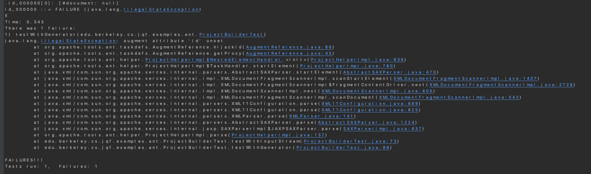

# Bug Report
***

## Bug Summary
* Type of Bug: 
java.lang.IllegalStateException: augment attribute 'id' unset

* Bug Description: 
When running tests for an automating software build processes, Apache Ant, with a Fuzzing testing tool, JQF, `java.lang.IllegalStateException` is thrown, indicating that the environment or application was in an inappropriate state for the requested operation.

## JQF Screenshot


## Details
#### Error Message:
- id_000000
```
java.lang.IllegalStateException: augment attribute 'id' unset
        at org.apache.tools.ant.taskdefs.AugmentReference.hijackId(AugmentReference.java:66)
        at org.apache.tools.ant.taskdefs.AugmentReference.getProxy(AugmentReference.java:45)
        at org.apache.tools.ant.helper.ProjectHelperImpl$NestedElementHandler.<init>(ProjectHelperImpl.java:836)
        at org.apache.tools.ant.helper.ProjectHelperImpl$TaskHandler.startElement(ProjectHelperImpl.java:780)
        at java.xml/com.sun.org.apache.xerces.internal.parsers.AbstractSAXParser.startElement(AbstractSAXParser.java:470)
        at java.xml/com.sun.org.apache.xerces.internal.impl.XMLDocumentFragmentScannerImpl.scanStartElement(XMLDocumentFragmentScannerImpl.java:1407)
        at java.xml/com.sun.org.apache.xerces.internal.impl.XMLDocumentFragmentScannerImpl$FragmentContentDriver.next(XMLDocumentFragmentScannerImpl.java:2726)
        at java.xml/com.sun.org.apache.xerces.internal.impl.XMLDocumentScannerImpl.next(XMLDocumentScannerImpl.java:605)
        at java.xml/com.sun.org.apache.xerces.internal.impl.XMLDocumentFragmentScannerImpl.scanDocument(XMLDocumentFragmentScannerImpl.java:542)
        at java.xml/com.sun.org.apache.xerces.internal.parsers.XML11Configuration.parse(XML11Configuration.java:889)
        at java.xml/com.sun.org.apache.xerces.internal.parsers.XML11Configuration.parse(XML11Configuration.java:825)
        at java.xml/com.sun.org.apache.xerces.internal.parsers.XMLParser.parse(XMLParser.java:141)
        at java.xml/com.sun.org.apache.xerces.internal.parsers.AbstractSAXParser.parse(AbstractSAXParser.java:1224)
        at java.xml/com.sun.org.apache.xerces.internal.jaxp.SAXParserImpl$JAXPSAXParser.parse(SAXParserImpl.java:637)
        at org.apache.tools.ant.helper.ProjectHelperImpl.parse(ProjectHelperImpl.java:137)
        at edu.berkeley.cs.jqf.examples.ant.ProjectBuilderTest.testWithInputStream(ProjectBuilderTest.java:73)
        at edu.berkeley.cs.jqf.examples.ant.ProjectBuilderTest.testWithGenerator(ProjectBuilderTest.java:88)

```

#### Error Analysis:

* `java.lang.IllegalStateException: augment attribute 'id' unset`:
the application was in an inappropriate state for the requested operation.

* `augment attribute 'id' unset` points to the fact that an operation attempted to use an attribute named 'id', which was expected to be set (initialized) but was not found.

* The exception originates from `AugmentReference.hijackId`, indicating the operation that failed was attempting to hijack or modify the 'id' attribute of an augment reference in an Apache Ant task.

* The exception propagates through `AugmentReference.getProxy`and several other internal methods,  being caught and reported in the testWithGenerator method of ProjectBuilderTest at the end.

## Scope of impact
#### Impacted Version: org.apache.ant 1.10.2

#### Potential Impact:

* Application fails to start: 
For applications relying on Apache Ant tasks for initialization or setup processes, this error could prevent the application from starting correctly, leading to downtime.

## Steps to recreate
* Use JQF to conduct Fuzz testing on the library, Apache Ant.
* Test with different Inputs of XML documents
* Observe the application throws `java.lang.IllegalStateException` 

## Suggestions to fix
* Improved Error Handling: 
With proper error handling and logging mechanisms, the state and context when errors occur can be well captured and reported, This can allowing quicker diagnosis and ways to solve the issues that may arise in production.

* Enhanced Testing and Validation: 
Implementation of comprehensive testing strategies, including unit tests, integration tests, end-to-end tests, and fuzz tests, can help catch such configuration issues early in the development lifecycle. 