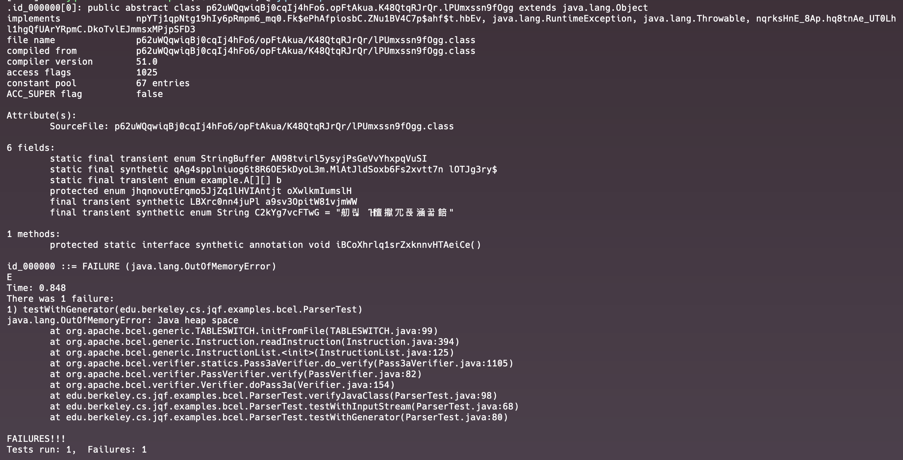
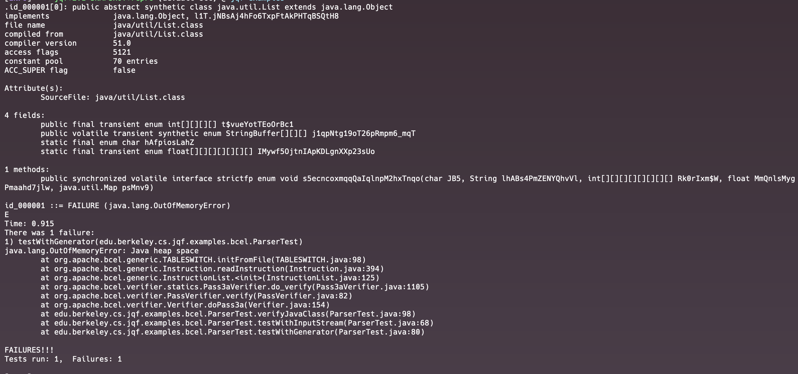
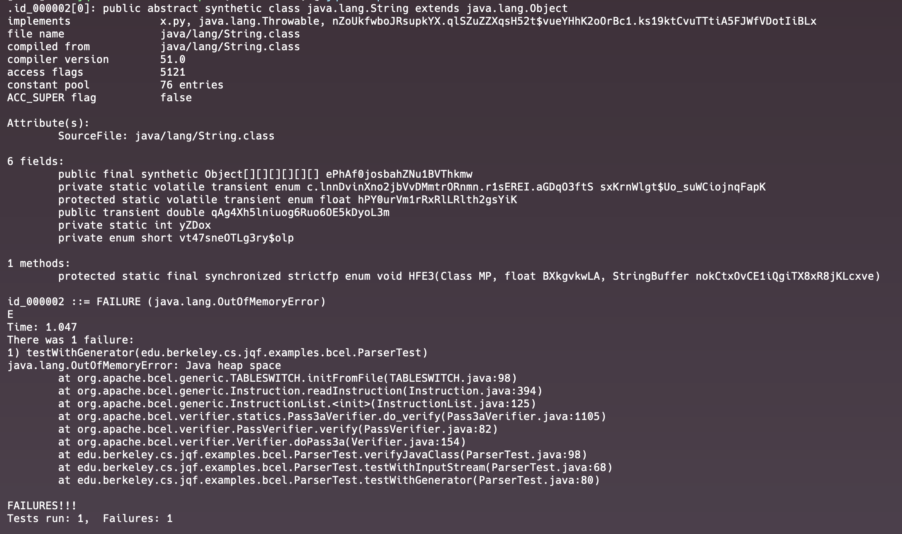

# Bug Report
***

## Bug Summary
* Type of Bug: 
java.lang.OutOfMemoryError: Java heap space

* Bug Description: 
When running tests for a Bytecode Engineering library, org.apache.bcel, with a Fuzzing testing tool, JQF,  `java.lang.OutOfMemoryError: Java heap space` errors are thrown because JVM exhausts the allocated heap space and cannot allocate more objects.

## JQF Screenshot



## Details
#### Error Message:
- id_000000
```
java.lang.OutOfMemoryError: Java heap space
	at org.apache.bcel.generic.TABLESWITCH.initFromFile(TABLESWITCH.java:99)
	at org.apache.bcel.generic.Instruction.readInstruction(Instruction.java:394)
	at org.apache.bcel.generic.InstructionList.<init>(InstructionList.java:125)
	at org.apache.bcel.verifier.statics.Pass3aVerifier.do_verify(Pass3aVerifier.java:1105)
	at org.apache.bcel.verifier.PassVerifier.verify(PassVerifier.java:82)
	at org.apache.bcel.verifier.Verifier.doPass3a(Verifier.java:154)
	at edu.berkeley.cs.jqf.examples.bcel.ParserTest.verifyJavaClass(ParserTest.java:98)
	at edu.berkeley.cs.jqf.examples.bcel.ParserTest.testWithInputStream(ParserTest.java:68)
	at edu.berkeley.cs.jqf.examples.bcel.ParserTest.testWithGenerator(ParserTest.java:80)
```
- id_000001
```
java.lang.OutOfMemoryError: Java heap space
	at org.apache.bcel.generic.TABLESWITCH.initFromFile(TABLESWITCH.java:98)
	at org.apache.bcel.generic.Instruction.readInstruction(Instruction.java:394)
	at org.apache.bcel.generic.InstructionList.<init>(InstructionList.java:125)
	at org.apache.bcel.verifier.statics.Pass3aVerifier.do_verify(Pass3aVerifier.java:1105)
	at org.apache.bcel.verifier.PassVerifier.verify(PassVerifier.java:82)
	at org.apache.bcel.verifier.Verifier.doPass3a(Verifier.java:154)
	at edu.berkeley.cs.jqf.examples.bcel.ParserTest.verifyJavaClass(ParserTest.java:98)
	at edu.berkeley.cs.jqf.examples.bcel.ParserTest.testWithInputStream(ParserTest.java:68)
	at edu.berkeley.cs.jqf.examples.bcel.ParserTest.testWithGenerator(ParserTest.java:80)
```
- id_000002
```
java.lang.OutOfMemoryError: Java heap space
	at org.apache.bcel.generic.TABLESWITCH.initFromFile(TABLESWITCH.java:98)
	at org.apache.bcel.generic.Instruction.readInstruction(Instruction.java:394)
	at org.apache.bcel.generic.InstructionList.<init>(InstructionList.java:125)
	at org.apache.bcel.verifier.statics.Pass3aVerifier.do_verify(Pass3aVerifier.java:1105)
	at org.apache.bcel.verifier.PassVerifier.verify(PassVerifier.java:82)
	at org.apache.bcel.verifier.Verifier.doPass3a(Verifier.java:154)
	at edu.berkeley.cs.jqf.examples.bcel.ParserTest.verifyJavaClass(ParserTest.java:98)
	at edu.berkeley.cs.jqf.examples.bcel.ParserTest.testWithInputStream(ParserTest.java:68)
	at edu.berkeley.cs.jqf.examples.bcel.ParserTest.testWithGenerator(ParserTest.java:80)
```
#### Error Analysis:

* java.lang.OutOfMemoryError: Java heap space, which means the process of parsing and verifying the Java class is consuming a large amount of memory.

* Such exceptions may be thrown due to the complexity of generated and tested classes, or inefficiencies in how resources are managed.

* Error is then caught at the method ParserTest.testWithGenerator

## Scope of impact
#### Impacted Version: org.apache.bcel 6.6.0

#### Potential Impact:

* Application Crash: 
Impacted applications may crash or become unresponsive, because the JVM has run out of memory and cannot allocate more objects, leading to a halt in operation.
* Data Loss:
If crashes occur during critical operations or transactions, critical data may be corrupted, if not lost.

## Steps to recreate
* Use JQF to conduct Fuzz testing on the library, Bcel.
* Test with different InputStream of Java Classes
* Observe the application throws java.lang.NumberFormatException 
## Suggestion to fix
* Increase Heap Size: 
Increase the maximum heap size available to the JVM if possible based on your system's available memory.

* Profile Memory Usage: 
Use a profiling tool to analyze memory usage during the test execution. This can help identify memory leaks or memory-intensive sections, and then improve memory use efficiency. 
