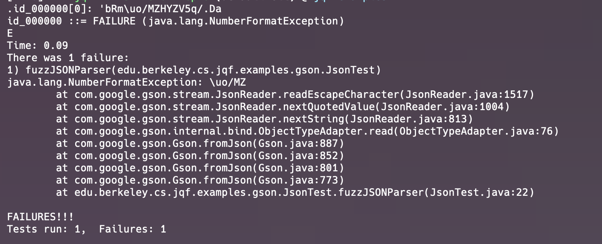
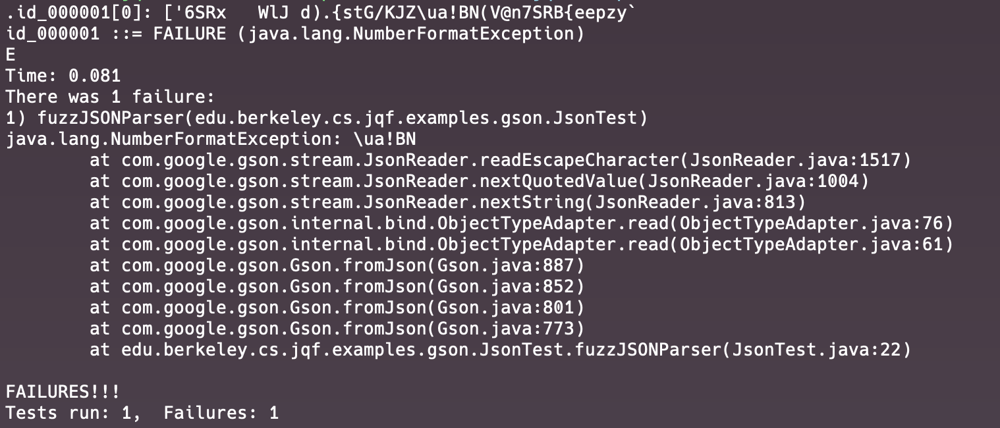

# Bug Report
***

## Bug Summary
* Type of Bug: 
Lack of input validation causing java.lang.NumberFormatException

* Bug Description: 
When running tests for a library, Gson, with a Fuzzing testing tool, JQF,  `java.lang.NumberFormatException` errors are thrown due to invalid character inputs.


## JQF Screenshot


## Details
#### Error Message:
- id_000000
```
java.lang.NumberFormatException: \uo/MZ
	at com.google.gson.stream.JsonReader.readEscapeCharacter(JsonReader.java:1517)
	at com.google.gson.stream.JsonReader.nextQuotedValue(JsonReader.java:1004)
	at com.google.gson.stream.JsonReader.nextString(JsonReader.java:813)
	at com.google.gson.internal.bind.ObjectTypeAdapter.read(ObjectTypeAdapter.java:76)
	at com.google.gson.Gson.fromJson(Gson.java:887)
	at com.google.gson.Gson.fromJson(Gson.java:852)
	at com.google.gson.Gson.fromJson(Gson.java:801)
	at com.google.gson.Gson.fromJson(Gson.java:773)
	at edu.berkeley.cs.jqf.examples.gson.JsonTest.fuzzJSONParser(JsonTest.java:22)
```
- id_000001
```
java.lang.NumberFormatException: \ua!BN
	at com.google.gson.stream.JsonReader.readEscapeCharacter(JsonReader.java:1517)
	at com.google.gson.stream.JsonReader.nextQuotedValue(JsonReader.java:1004)
	at com.google.gson.stream.JsonReader.nextString(JsonReader.java:813)
	at com.google.gson.internal.bind.ObjectTypeAdapter.read(ObjectTypeAdapter.java:76)
	at com.google.gson.internal.bind.ObjectTypeAdapter.read(ObjectTypeAdapter.java:61)
	at com.google.gson.Gson.fromJson(Gson.java:887)
	at com.google.gson.Gson.fromJson(Gson.java:852)
	at com.google.gson.Gson.fromJson(Gson.java:801)
	at com.google.gson.Gson.fromJson(Gson.java:773)
	at edu.berkeley.cs.jqf.examples.gson.JsonTest.fuzzJSONParser(JsonTest.java:22)
```

#### Error Analysis:

* java.lang.NumberFormatException, which means converting a not appropriately formatted string to one of the numeric types.

* com.google.gson.stream.JsonReader.readEscapeCharacter shows that errors are thrown when reading escape characters. Consider the inputs causing the errors are `\uo/MZ` and `\ua!BN`, the escape sequence `\u` must be followed by exactly four hexadecimal digits (0-9, A-F), and `/` and `!` are not expected.
* Error is then caught at the method JsonTest.fuzzJSONParser

## Scope of impact
#### Impacted Version: com.google.code.gson 2.8.9

#### Potential Impact:

* Application Crash:
Unhandled exceptions may lead to application crashes, affecting the availability of the application/service.
* Security Risk:
If attackers manage to control the input involving the vulnerable method and cause application crashes, DoS attacks may be achievable .

## Steps to recreate
* Use JQF to conduct Fuzz testing on the library, Gson.
* input one escape sequence with respective invalid following characters
* Observe the application throws java.lang.NumberFormatException。
## Suggestion to fix
* Input Validation: 
Input shall always be validated before parsing, which ensures the validity of the data
* Exception handling:
Properly setting up exception catching logic when using the parsing method allows the application to function without crashing.
* Adopt the latest version:
Check the latest version of the library. If the related bugs are fixed, updating to the version shall be considered.