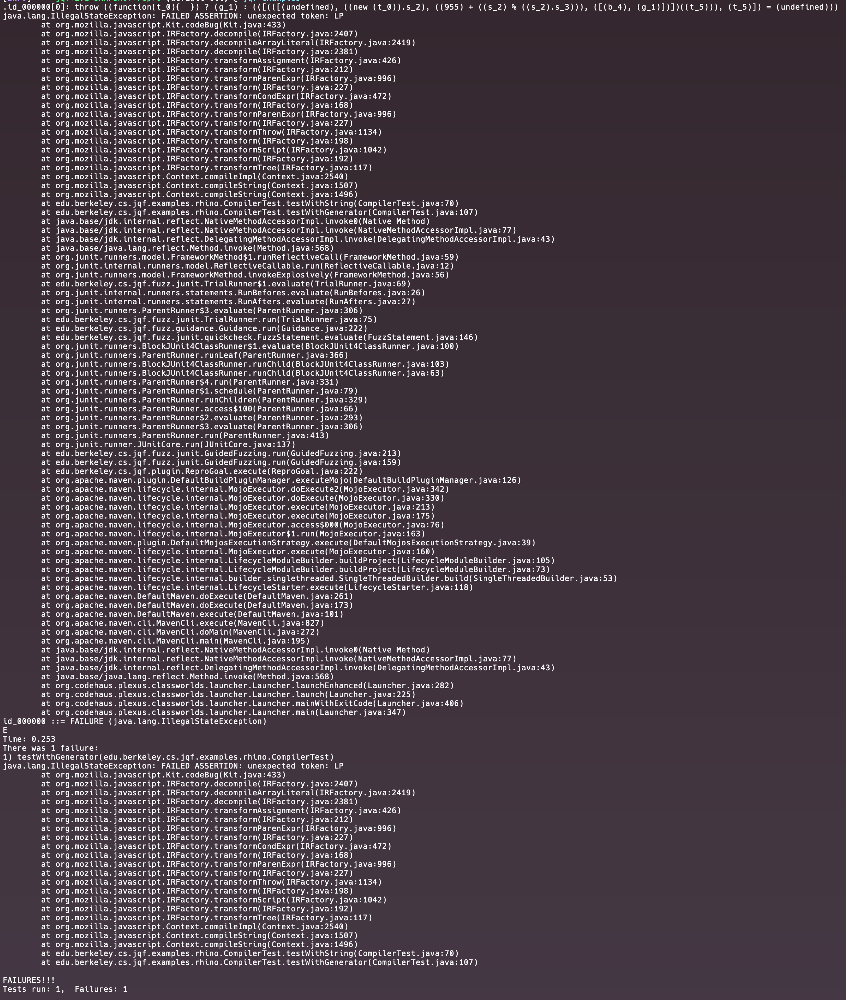

# Bug Report
***

## Bug Summary
* Type of Bug: 
java.lang.IllegalStateException

* Bug Description: 
When running tests for a library, Rhino, with a Fuzzing testing tool, JQF,  `java.lang.NumberFormatException` errors are thrown due to a failure within the Rhino JavaScript engine, which is used for compiling and executing JavaScript code in Java applications


## JQF Screenshot

## Details
#### Error Message:
- id_000000
```
java.lang.IllegalStateException: FAILED ASSERTION: unexpected token: LP
	at org.mozilla.javascript.Kit.codeBug(Kit.java:433)
	at org.mozilla.javascript.IRFactory.decompile(IRFactory.java:2407)
	at org.mozilla.javascript.IRFactory.decompileArrayLiteral(IRFactory.java:2419)
	at org.mozilla.javascript.IRFactory.decompile(IRFactory.java:2381)
	at org.mozilla.javascript.IRFactory.transformAssignment(IRFactory.java:426)
	at org.mozilla.javascript.IRFactory.transform(IRFactory.java:212)
	at org.mozilla.javascript.IRFactory.transformParenExpr(IRFactory.java:996)
	at org.mozilla.javascript.IRFactory.transform(IRFactory.java:227)
	at org.mozilla.javascript.IRFactory.transformCondExpr(IRFactory.java:472)
	at org.mozilla.javascript.IRFactory.transform(IRFactory.java:168)
	at org.mozilla.javascript.IRFactory.transformParenExpr(IRFactory.java:996)
	at org.mozilla.javascript.IRFactory.transform(IRFactory.java:227)
	at org.mozilla.javascript.IRFactory.transformThrow(IRFactory.java:1134)
	at org.mozilla.javascript.IRFactory.transform(IRFactory.java:198)
	at org.mozilla.javascript.IRFactory.transformScript(IRFactory.java:1042)
	at org.mozilla.javascript.IRFactory.transform(IRFactory.java:192)
	at org.mozilla.javascript.IRFactory.transformTree(IRFactory.java:117)
	at org.mozilla.javascript.Context.compileImpl(Context.java:2540)
	at org.mozilla.javascript.Context.compileString(Context.java:1507)
	at org.mozilla.javascript.Context.compileString(Context.java:1496)
	at edu.berkeley.cs.jqf.examples.rhino.CompilerTest.testWithString(CompilerTest.java:70)
	at edu.berkeley.cs.jqf.examples.rhino.CompilerTest.testWithGenerator(CompilerTest.java:107)
```


#### Error Analysis:

* java.lang.IllegalStateException: FAILED ASSERTION: unexpected token: LP
The core of the error is an assertion failure due to an "unexpected token: LP". This suggests that the JavaScript code being compiled contains a syntactic issue that Rhino did not expect. 

* The abbreviation "LP" likely refers to a left parenthesis, hinting there is a problem with how expressions or function calls are structured in the generated JavaScript code. 

* Error is then caught at the method JsonTest.testWithGenerator

## Scope of impact
#### Impacted Version: org.mozilla:rhino 1.7.8

#### Potential Impact:
* Service Stability:
The application may crash or behave unpredictably when running the specific JavaScript code without checking and triggering the error, leading to a deteriorated user experience.

* Security Risk:
If attackers manage to control the input involving the vulnerable method and cause application crashes, DoS attacks may be achievable .

## Steps to recreate
* Use JQF to conduct Fuzz testing on the library, rhino.
* Fuzzing with generated JavaScript Code
* Observe the application throws java.lang.IllegalStateException

## Suggestion to fix
* Code Isolation:
Try isolating the piece of JavaScript code that causes the error and catch the exception properly, containing the scope of impact instead of bringing down the whole application.

* Adopt the latest version:
Update Rhino Version: If you're not using the latest version of Rhino, consider updating. Newer versions might have improved error handling or support for JavaScript constructs that are causing issues in your current setup.  
