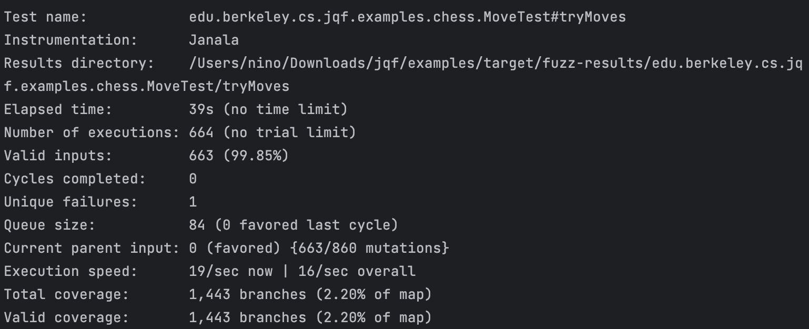

# 漏洞报告

## JQF报错截图



## 报错信息

```
java.lang.ArithmeticException: / by zero
        at edu.berkeley.cs.jqf.examples.chess.MoveTest.tryMoves(MoveTest.java:55)
```

## 漏洞描述

漏洞类型：运行时异常

漏洞描述：在对chess库进行测试时，发现存在一个除0错误，该错误会导致程序崩溃。

## 异常分析

- java.lang.ArithmeticException: / by zero 表示在进行除法运算时，除数为零。
- 异常发生在 RationalNumber.intValue 方法

## 复现步骤

- 使用模糊测试工具（如 Jazzer）对 Apache chess 库进行测试。
- 观察程序抛出 java.lang.ArithmeticException: / by zero 异常。

## 漏洞原理

**除零错误** 除零错误是指在进行除法运算时，除数为零，导致程序抛出 ArithmeticException 异常。这种错误通常是由于缺乏对输入数据的有效性检查引起的。攻击者可以利用这种漏洞，通过构造恶意输入，导致程序崩溃或拒绝服务。