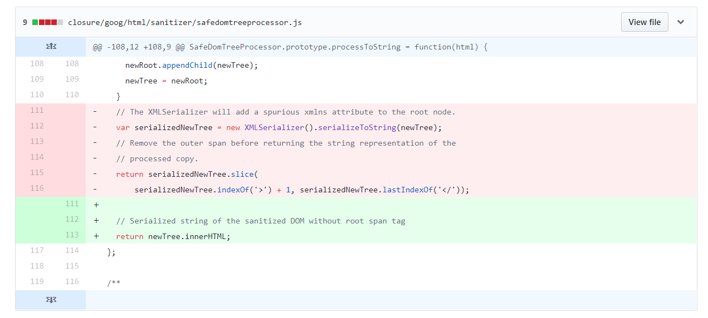
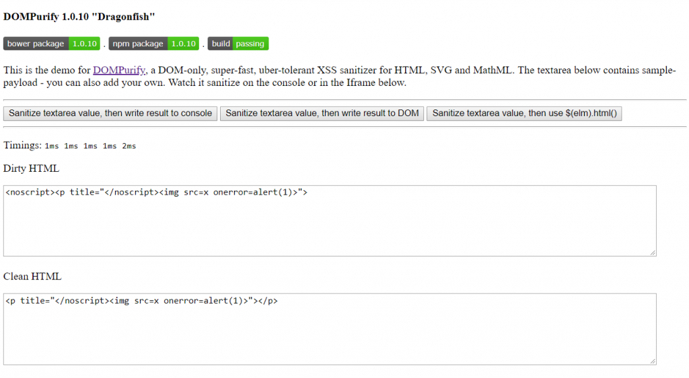
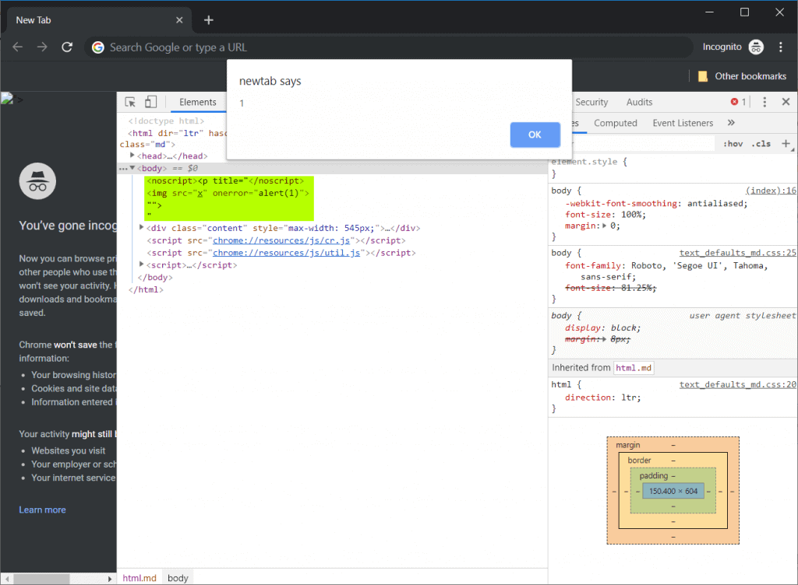
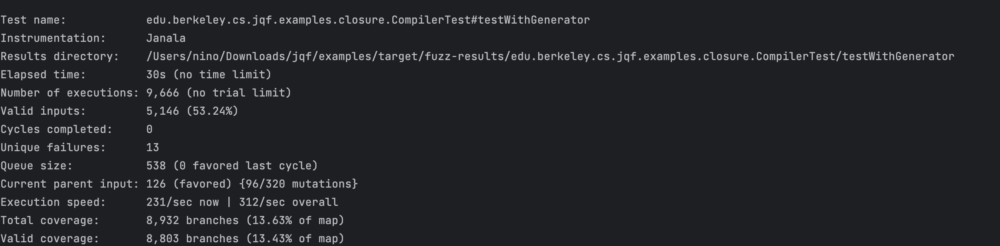

# Google Search XSS

On September 26, 2018, one of the developers working on the open-source [Closure](https://github.com/google/closure-library) library (originally created by Google and used in Google Search) created a commit that removed part of input sanitization. Supposedly, this was because they encountered issues with user interface design. The author of this commit and its reviewers failed to notice that this change introduced an XSS vulnerability.

## How Did the XSS Happen?

The vulnerability in the Closure library was very difficult to detect. It relied on a rarely used technique called *mutation XSS*. Mutation XSS vulnerabilities are caused by differences in how browsers interpret the HTML standard.

Due to browser differences, it is very difficult to sanitize user input on the server. The server needs to account for all differences between not only browsers but also their versions. The most efficient way to sanitize input against XSS is to do it by letting the browser interpret input without actually executing it.

There is an excellent client-side library for XSS sanitization: [DOMPurify](https://github.com/cure53/DOMPurify). This library is also used by Closure. However, DOMPurify is not foolproof. In rare cases, extra sanitization is needed. And it was exactly that extra sanitization that was removed in September 2018 with the update to Closure.



## How Does DOMPurify Work?

DOMPurify sanitizes user input by using the `template` element. Browsers process the `innerHtml` property of the `div` element and the same property of the `template` element differently. In the case of the `div` element, `innerHtml` is executed immediately after it is assigned a value. In the case of the `template` element, you can apply sanitization before execution.

The idea behind DOMPurify is to take the user input, assign it to the `innerHtml` property of the `template` element, have the browser interpret it (but not execute it), and then sanitize it for potential XSS. However, it is the logic behind that interpretation that is the underlying cause of the mutation XSS.

## How Does the Browser Interpret Invalid HTML?

To understand how browsers interpret invalid HTML, create an HTML document with only the following content:

```
<div><script title="</div>">
```

When you open it in the browser, you will see that the code is interpreted as follows:

```
<html>
<head></head>
<body>
<div>
<script title="</div>"></script>
</div>
</body>
</html>
```

Now, try to create a HTML document with the following content:

```
<script><div title="</script>">
```

The browser interprets this code differently:

```
<html>
<head>
<script><div title="</script>
</head>
<body>
">
</body>
</html>
```

This difference is due to the fact that when the browser encounters the `<script>` tag, it switches from the HTML parser to the JavaScript parser until the closing tag is found.

### The Evil Behind noscript noscript

In most cases, the browser will interpret the same document always in the same way independent of circumstances. However, there is one case where this behavior may be different due to certain client-side circumstances: the `noscript` tag.

The HTML specification states that the `noscript` tag must be interpreted differently depending on whether JavaScript is enabled in the browser or not. This difference in browser behavior is exactly what Masato Kinugawa used for his XSS proof-of-concept attack. It turns out that invalid HTML code is interpreted differently when assigned to the `innerHtml` property of the `template` element (as if JavaScript was disabled) and differently when assigned to the `innerHtml` property of the `div` element (as if JavaScript was enabled).

### The Proof-of-Concept Attack

using the following payload to perform the proof-of-concept attack:

```
<noscript><p title="</noscript>">
```

If JavaScript is disabled (as for the `template` element used by DOMPurify for XSS sanitization) the browser interprets the payload in the following way:

```
<noscript>
<p title="</noscript>"></p>
</noscript>
```

The `"</noscript>"` is the value of the `title` argument. Therefore, DOMPurify does not sanitize the input content because there is no JavaScript so there is no XSS risk.



However, if JavaScript is enabled (as for the `div` element used by the browser) the browser interprets the payload the following way:

```
<noscript><p title="</noscript>

"">
"
```

The `noscript` element ends early and the `img` element is interpreted fully, including the JavaScript content of the `onerror` attribute.



## JQF Screenshot



## Suggestion to fix

A Node.js module wrapper for downloading/installing the latest version of the Google Closure tools. Downloads the latest versions upon install, rather than during prepublish. As such, a consumer can always just run `npm update`/`npm install` to get the latest updates despite the module's version being unchanged.

```
npm install google-closure-tools-latest
```

usage

```
var gct = require('google-closure-tools-latest');
 
// Install the Google Closure tools into a specific target dir
var installDir = __dirname + '/closure-tools';
gct(installDir);
```

