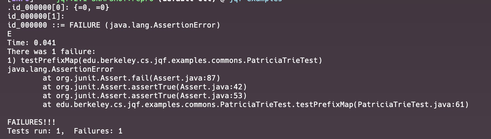

# Bug Report
***

## Bug Summary
* Type of Bug: 
Trie prefix map does not contain proper keys, nor keys with expected prefix

* Bug Description: 
PrefixMap built using class `PatriciaTrie` from `org.apache.commons.collections4.trie.PatriciaTrie` contains some keys with no expected prefix. Thus, the Junit testing method `assertTrue` returns false and throw `java.lang.AssertionError` 

## JQF Screenshot

#### Error Message:
- id_000000
```
java.lang.AssertionError
	at org.junit.Assert.fail(Assert.java:87)
	at org.junit.Assert.assertTrue(Assert.java:42)
	at org.junit.Assert.assertTrue(Assert.java:53)
	at edu.berkeley.cs.jqf.examples.commons.PatriciaTrieTest.testPrefixMap(PatriciaTrieTest.java:61)
```

#### Error Analysis:

* the Junit testing method `assertTrue` returns false and throw `java.lang.AssertionError` due to unexpected results.

* When verifying that a prefix map contains all keys starting with `prefix`, built using the `prefixMap(prefix)` method from the `PatriciaTrie` class in `org.apache.commons.collections4.trie.PatriciaTrie`, an unexpected issue is discovered. It's found that some keys in the prefix map do not actually start with the expected `prefix`. As a result, the JUnit test method using `assertTrue` fails and throws a `java.lang.AssertionError`.


## Scope of impact
#### Impacted Version: org.apache.commons:commons-collections4 4.3

#### Potential Impact:

* Incorrect Data Retrieval:
If the prefixMap method of the PatriciaTrie class does not correctly filter keys based on the prefix, it could lead to incorrect data being retrieved in production.
* Broken Data Integrity:
Keys expected to be present in the prefixMap that are not could lead to data integrity issues, where data that should be accessible based on the prefix criteria is not available, potentially leading to the application logic being broken or incorrect results.

## Steps to recreate
* Use JQF to conduct Fuzz testing on the library, Gson.
* Build a prefix map containing all keys starting with `prefix` by using the `prefixMap(prefix)` method from the `PatriciaTrie`
* Test and verify keys of the map to contain the expected prefix/
* Observe the application throws java.lang.AssertionError from the testing。

## Suggestion to fix
* Careful Implementation with Code Review and Analysis: 
Review the implementation of the prefixMap method to ensure it correctly processes the keys based on the prefix.
* Monitoring and Logging:
Implement detailed monitoring and logging in production to quickly identify and address any discrepancies in data retrieval functionalities.
* Fallback Mechanisms:
Arrange implementing fallback mechanisms or other data retrieval strategies to ensure the application can maintain functionality if issues are reported from monitoring and logging.
