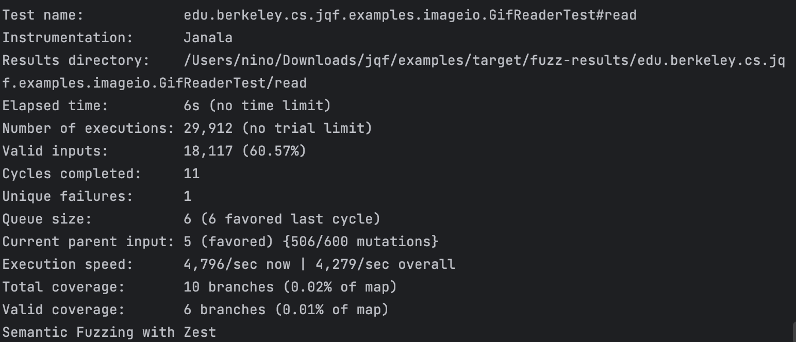

# 漏洞报告

## JQF截图



## 报错信息

```
java.lang.IllegalStateException - Bytes from linear input out of order. Size = 10240, Key = 10241
```

## 漏洞描述

`java.lang.IllegalStateException: Bytes from linear input out of order` 是一种异常，通常在处理字节流或文件输入输出时出现。这个异常的意思是，程序在读取或处理字节数据时，发现字节的顺序不符合预期。

导致这个异常的原因可能有以下几种：

1. **多线程问题**：如果多个线程同时读取或写入同一个字节流，可能会导致字节顺序混乱。确保对字节流的访问是线程安全的。
2. **数据损坏**：如果输入的数据文件或流在传输或存储过程中损坏，可能会导致读取时字节顺序不正确。
3. **错误的读取逻辑**：程序在读取字节流时，可能使用了错误的逻辑或方法，导致读取顺序不正确。
4. **缓冲区问题**：如果使用了缓冲区来读取数据，可能缓冲区的管理出现问题，导致读取顺序错误。

## 漏洞影响

`java.lang.IllegalStateException: Bytes from linear input out of order` 这个异常本身并不是一个漏洞，而是一个运行时错误，表示程序在处理字节流时遇到了意外的字节顺序问题。尽管它不是一个安全漏洞，但如果不加以处理，可能会导致以下问题：

1. **数据完整性问题**：
   - 如果程序依赖于正确的字节顺序来解析数据，那么字节顺序错误可能会导致数据解析失败或数据损坏。
   - 例如，读取文件内容时，如果字节顺序不正确，可能会导致文件内容被错误地解释或丢失部分数据。
2. **程序崩溃**：
   - 这个异常会导致程序在运行时崩溃，特别是在没有适当的异常处理机制时。
   - 程序崩溃会影响用户体验，并可能导致数据丢失或服务中断。
3. **数据安全问题**：
   - 虽然这个异常本身不是安全漏洞，但如果程序在处理敏感数据时出现这种异常，可能会导致部分敏感数据暴露或丢失。
   - 例如，在网络传输过程中，如果字节顺序错误，可能会导致传输的数据被截断或篡改。
4. **资源泄漏**：
   - 如果异常发生时没有正确关闭资源（如文件句柄、网络连接等），可能会导致资源泄漏，进而影响系统性能。
   - 资源泄漏可能会导致系统资源耗尽，影响其他程序的正常运行。

## 解决方法

要解决这个问题，可以尝试以下步骤：

1. **检查多线程访问**：确保对字节流的访问是线程安全的。如果需要，可以使用同步机制或锁来保护对字节流的访问。
2. **验证数据完整性**：检查输入的数据文件或流是否完整无损。如果数据损坏，可能需要重新获取或修复数据。
3. **调试读取逻辑**：仔细检查读取字节流的代码逻辑，确保读取顺序正确。可以通过日志或调试工具来跟踪字节读取的顺序。
4. **管理缓冲区**：如果使用了缓冲区，确保缓冲区的管理正确，避免缓冲区溢出或数据丢失。