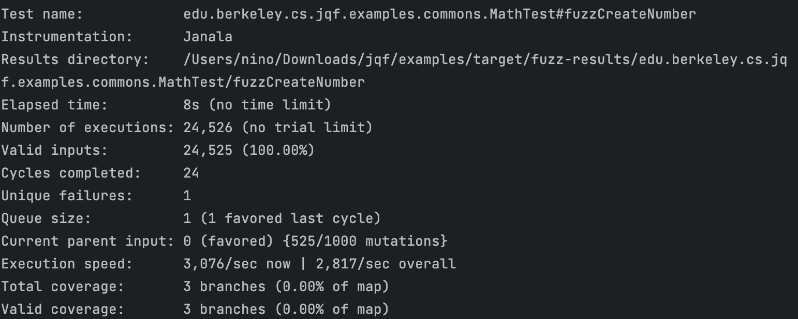

# 漏洞报告

## JQF截图



## 报错信息

```
Java Exception: java.lang.NumberFormatException: -
       at org.apache.commons.lang3.math.NumberUtils.integerValue(JSONLexerBase.java:486)
```

## 漏洞概述

**漏洞类型:** 输入验证缺陷

**漏洞描述:** 在使用JQF工具测试开源的lang3 math库时，发现java.lang.NumberFormatException异常。这表明在数据时，输入数据包含非法的数字格式，导致程序抛出异常。

## 异常分析:

- java.lang.NumberFormatException: - 表示在解析过程中遇到了非法的数字格式（例如单独的负号）。
- 异常发生在 org.apache.commons.lang3.math.NumberUtils.integerValue 方法中，该方法负责将字符串解析为整数。

## 复现步骤

- 使用JQF工具对Lang3 math库进行模糊测试。
- 提供包含非法数字格式（例如单独的负号）的数据。
- 观察程序抛出 java.lang.NumberFormatException 异常。