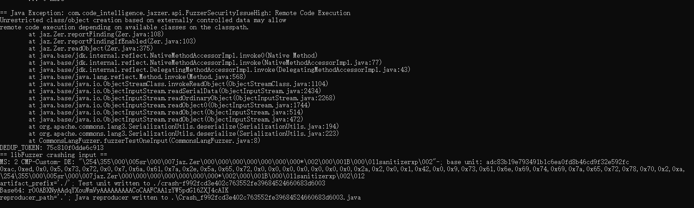

# 漏洞报告
***

## 报错信息
```

== Java Exception: com.code_intelligence.jazzer.api.FuzzerSecurityIssueHigh: Remote Code Execution
Unrestricted class/object creation based on externally controlled data may allow
remote code execution depending on available classes on the classpath.
        at jaz.Zer.reportFinding(Zer.java:108)
        at jaz.Zer.reportFindingIfEnabled(Zer.java:103)
        at jaz.Zer.readObject(Zer.java:375)
        at java.base/jdk.internal.reflect.NativeMethodAccessorImpl.invoke0(Native Method)
        at java.base/jdk.internal.reflect.NativeMethodAccessorImpl.invoke(NativeMethodAccessorImpl.java:77)
        at java.base/jdk.internal.reflect.DelegatingMethodAccessorImpl.invoke(DelegatingMethodAccessorImpl.java:43)
        at java.base/java.lang.reflect.Method.invoke(Method.java:568)
        at java.base/java.io.ObjectStreamClass.invokeReadObject(ObjectStreamClass.java:1104)
        at java.base/java.io.ObjectInputStream.readSerialData(ObjectInputStream.java:2434)
        at java.base/java.io.ObjectInputStream.readOrdinaryObject(ObjectInputStream.java:2268)
        at java.base/java.io.ObjectInputStream.readObject0(ObjectInputStream.java:1744)
        at java.base/java.io.ObjectInputStream.readObject(ObjectInputStream.java:514)
        at java.base/java.io.ObjectInputStream.readObject(ObjectInputStream.java:472)
        at org.apache.commons.lang3.SerializationUtils.deserialize(SerializationUtils.java:194)
        at org.apache.commons.lang3.SerializationUtils.deserialize(SerializationUtils.java:223)
        at CommonsLangFuzzer.fuzzerTestOneInput(CommonsLangFuzzer.java:8)
DEDUP_TOKEN: 75c810f0dde6c913
== libFuzzer crashing input ==
MS: 2 CMP-Custom- DE: "\254\355\000\005sr\000\007jaz.Zer\000\000\000\000\000\000\000*\002\000\001B\000\011sanitizerxp\002"-; base unit: adc83b19e793491b1c6ea0fd8b46cd9f32e592fc
0xac,0xed,0x0,0x5,0x73,0x72,0x0,0x7,0x6a,0x61,0x7a,0x2e,0x5a,0x65,0x72,0x0,0x0,0x0,0x0,0x0,0x0,0x0,0x2a,0x2,0x0,0x1,0x42,0x0,0x9,0x73,0x61,0x6e,0x69,0x74,0x69,0x7a,0x65,0x72,0x78,0x70,0x2,0xa,
\254\355\000\005sr\000\007jaz.Zer\000\000\000\000\000\000\000*\002\000\001B\000\011sanitizerxp\002\012
artifact_prefix='./'; Test unit written to ./crash-f992fcd3e402c763552fe39684524660683d6003
Base64: rO0ABXNyAAdqYXouWmVyAAAAAAAAACoCAAFCAAlzYW5pdGl6ZXJ4cAIK
reproducer_path='.'; Java reproducer written to .\Crash_f992fcd3e402c763552fe39684524660683d6003.java
```
## jazzer 报错截图

## 漏洞概述
***
**漏洞类型:** 远程代码执行 (Remote Code Execution)

**漏洞描述:** 在对 Apache Commons Lang 库进行测试时，发现存在一个未受限制的类/对象创建漏洞。该漏洞允许根据外部控制的数据创建任意类/对象，可能导致远程代码执行。

## 异常分析:
***
* 异常信息: Remote Code Execution 表示存在未受限制的类/对象创建漏洞，可能允许攻击者根据外部控制的数据执行任意代码。
* 异常位置: 异常发生在 Zer.readObject 方法中。
* 传播路径: 异常沿着调用栈传播，最终在 CommonsLangFuzzer.fuzzerTestOneInput 方法中被捕获。
#### 调用栈:
```
at jaz.Zer.reportFinding(Zer.java:108)
at jaz.Zer.reportFindingIfEnabled(Zer.java:103)
at jaz.Zer.readObject(Zer.java:375)
at java.base/jdk.internal.reflect.NativeMethodAccessorImpl.invoke0(Native Method)
at java.base/jdk.internal.reflect.NativeMethodAccessorImpl.invoke(NativeMethodAccessorImpl.java:77)
at java.base/jdk.internal.reflect.DelegatingMethodAccessorImpl.invoke(DelegatingMethodAccessorImpl.java:43)
at java.base/java.lang.reflect.Method.invoke(Method.java:568)
at java.base/java.io.ObjectStreamClass.invokeReadObject(ObjectStreamClass.java:1104)
at java.base/java.io.ObjectInputStream.readSerialData(ObjectInputStream.java:2434)
at java.base/java.io.ObjectInputStream.readOrdinaryObject(ObjectInputStream.java:2268)
at java.base/java.io.ObjectInputStream.readObject0(ObjectInputStream.java:1744)
at java.base/java.io.ObjectInputStream.readObject(ObjectInputStream.java:514)
at java.base/java.io.ObjectInputStream.readObject(ObjectInputStream.java:472)
at org.apache.commons.lang3.SerializationUtils.deserialize(SerializationUtils.java:194)
at org.apache.commons.lang3.SerializationUtils.deserialize(SerializationUtils.java:223)
at CommonsLangFuzzer.fuzzerTestOneInput(CommonsLangFuzzer.java:8)
```
## 影响范围
#### 受影响版本: Apache Commons Lang 3.x 版本

#### 潜在影响:
***
* 远程代码执行: 攻击者可以通过构造恶意输入数据，利用该漏洞在目标系统上执行任意代码，导致系统被完全控制。
* 数据泄露: 攻击者能够访问和篡改敏感数据，导致数据泄露和篡改。
* 系统崩溃: 恶意代码可能导致系统崩溃，影响系统的稳定性和可用性。

## 复现步骤
***
* 使用模糊测试工具（如 Jazzer）对 Apache Commons Lang 库进行测试。
* 提供特定的序列化数据输入，触发远程代码执行漏洞。
* 观察程序抛出 com.code_intelligence.jazzer.api.FuzzerSecurityIssueHigh: Remote Code Execution 异常。
## 修复建议
***
* 输入验证: 在反序列化过程中，增加对输入数据的严格验证，确保仅允许可信数据进行反序列化。
* 安全反序列化: 使用安全的反序列化库和方法，避免使用可能带来安全风险的反序列化机制。
* 更新库: 检查 Apache Commons Lang 库的最新版本，查看是否已有相关修复，并考虑升级到最新版本。
* 安全编码实践: 遵循安全编码实践，确保代码在处理输入数据时不会引入安全漏洞。
* 使用白名单: 实现反序列化时，使用类白名单机制，限制反序列化的类范围，防止加载不安全的类。

## 漏洞原理
**远程代码执行**
远程代码执行漏洞是指攻击者可以通过网络向目标系统发送特制的数据包，利用系统中的漏洞执行任意代码。这种漏洞通常是由于缺乏对输入数据的严格验证和安全编码实践引起的。攻击者可以利用这种漏洞，获得系统的完全控制权，进行恶意操作。