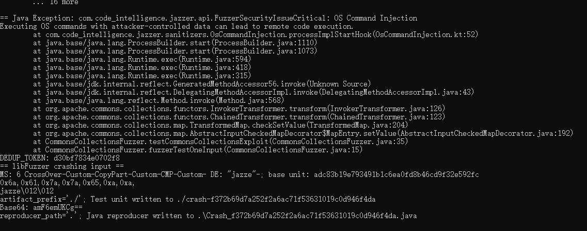

# 漏洞报告
***

## 报错信息
```
== Java Exception: com.code_intelligence.jazzer.api.FuzzerSecurityIssueCritical: OS Command Injection
Executing OS commands with attacker-controlled data can lead to remote code execution.
        at com.code_intelligence.jazzer.sanitizers.OsCommandInjection.processImplStartHook(OsCommandInjection.kt:52)
        at java.base/java.lang.ProcessBuilder.start(ProcessBuilder.java:1110)
        at java.base/java.lang.ProcessBuilder.start(ProcessBuilder.java:1073)
        at java.base/java.lang.Runtime.exec(Runtime.java:594)
        at java.base/java.lang.Runtime.exec(Runtime.java:418)
        at java.base/java.lang.Runtime.exec(Runtime.java:315)
        at java.base/jdk.internal.reflect.GeneratedMethodAccessor56.invoke(Unknown Source)
        at java.base/jdk.internal.reflect.DelegatingMethodAccessorImpl.invoke(DelegatingMethodAccessorImpl.java:43)
        at java.base/java.lang.reflect.Method.invoke(Method.java:568)
        at org.apache.commons.collections.functors.InvokerTransformer.transform(InvokerTransformer.java:126)
        at org.apache.commons.collections.functors.ChainedTransformer.transform(ChainedTransformer.java:123)
        at org.apache.commons.collections.map.TransformedMap.checkSetValue(TransformedMap.java:204)
        at org.apache.commons.collections.map.AbstractInputCheckedMapDecorator$MapEntry.setValue(AbstractInputCheckedMapDecorator.java:192)
        at CommonsCollectionsFuzzer.testCommonsCollectionsExploit(CommonsCollectionsFuzzer.java:35)
        at CommonsCollectionsFuzzer.fuzzerTestOneInput(CommonsCollectionsFuzzer.java:15)
DEDUP_TOKEN: d30bf7834e0702f8
== libFuzzer crashing input ==
MS: 6 CrossOver-Custom-CopyPart-Custom-CMP-Custom- DE: "jazze"-; base unit: adc83b19e793491b1c6ea0fd8b46cd9f32e592fc
0x6a,0x61,0x7a,0x7a,0x65,0xa,0xa,
jazze\012\012
artifact_prefix='./'; Test unit written to ./crash-f372b69d7a252f2a6ac71f53631019c0d946f4da
Base64: amF6emUKCg==
reproducer_path='.'; Java reproducer written to .\Crash_f372b69d7a252f2a6ac71f53631019c0d946f4da.java
```
## jazzer 报错截图

## 漏洞概述
***
**漏洞类型:** 操作系统命令注入 (OS Command Injection)

**漏洞描述:** 在对 Apache Commons Collections 库进行测试时，发现存在一个操作系统命令注入漏洞。该漏洞允许根据攻击者控制的数据执行操作系统命令，可能导致远程代码执行。

## 异常分析:
***
* 异常信息: OS Command Injection 表示存在命令注入漏洞，可能允许攻击者通过控制输入数据执行操作系统命令。
* 异常位置: 异常发生在 InvokerTransformer.transform 方法中。
* 传播路径: 异常沿着调用栈传播，最终在 CommonsCollectionsFuzzer.fuzzerTestOneInput 方法中被捕获。
#### 调用栈:
```
at com.code_intelligence.jazzer.sanitizers.OsCommandInjection.processImplStartHook(OsCommandInjection.kt:52)
at java.base/java.lang.ProcessBuilder.start(ProcessBuilder.java:1110)
at java.base/java.lang.ProcessBuilder.start(ProcessBuilder.java:1073)
at java.base/java.lang.Runtime.exec(Runtime.java:594)
at java.base/java.lang.Runtime.exec(Runtime.java:418)
at java.base/java.lang.Runtime.exec(Runtime.java:315)
at java.base/jdk.internal.reflect.GeneratedMethodAccessor56.invoke(Unknown Source)
at java.base/jdk.internal.reflect.DelegatingMethodAccessorImpl.invoke(DelegatingMethodAccessorImpl.java:43)
at java.base/java.lang.reflect.Method.invoke(Method.java:568)
at org.apache.commons.collections.functors.InvokerTransformer.transform(InvokerTransformer.java:126)
at org.apache.commons.collections.functors.ChainedTransformer.transform(ChainedTransformer.java:123)
at org.apache.commons.collections.map.TransformedMap.checkSetValue(TransformedMap.java:204)
at org.apache.commons.collections.map.AbstractInputCheckedMapDecorator$MapEntry.setValue(AbstractInputCheckedMapDecorator.java:192)
at CommonsCollectionsFuzzer.testCommonsCollectionsExploit(CommonsCollectionsFuzzer.java:35)
at CommonsCollectionsFuzzer.fuzzerTestOneInput(CommonsCollectionsFuzzer.java:15)
```
## 影响范围
#### 受影响版本: Apache Commons Collections 3.x 和 4.x 版本

#### 潜在影响:
***
* 远程代码执行: 攻击者可以通过构造恶意输入数据，利用该漏洞在目标系统上执行任意操作系统命令，导致系统被完全控制。
* 数据泄露: 攻击者能够访问和篡改敏感数据，导致数据泄露和篡改。
* 系统崩溃: 恶意命令可能导致系统崩溃，影响系统的稳定性和可用性。

## 复现步骤
***
* 使用模糊测试工具（如 Jazzer）对 Apache Commons Collections 库进行测试。
* 提供特定的输入数据，触发操作系统命令注入漏洞。
* 观察程序抛出 com.code_intelligence.jazzer.api.FuzzerSecurityIssueCritical: OS Command Injection 异常。
## 修复建议
***
* 输入验证: 在执行操作系统命令之前，增加对输入数据的严格验证，确保仅允许可信数据作为命令参数。
* 避免动态命令执行: 避免使用 Runtime.exec 和 ProcessBuilder 等动态命令执行方法，改用更安全的替代方案。
* 更新库: 检查 Apache Commons Collections 库的最新版本，查看是否已有相关修复，并考虑升级到最新版本。
* 安全编码实践: 遵循安全编码实践，确保代码在处理输入数据时不会引入安全漏洞。
* 使用白名单: 实现命令执行时，使用参数白名单机制，限制允许执行的命令范围，防止执行不安全的命令。

## 漏洞原理
**操作系统命令注入**
操作系统命令注入漏洞是指攻击者可以通过控制输入数据，执行任意操作系统命令。这种漏洞通常是由于缺乏对输入数据的严格验证和安全编码实践引起的。攻击者可以利用这种漏洞，获得系统的完全控制权，进行恶意操作。