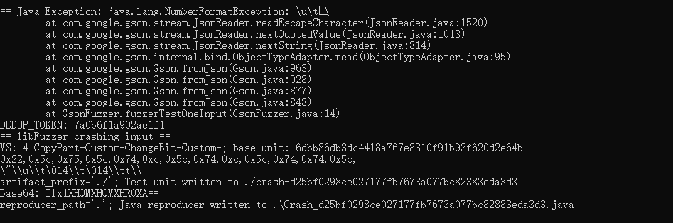

# 漏洞报告
***

## 报错信息
```
== Java Exception: java.lang.NumberFormatException: \u\t\
        at com.google.gson.stream.JsonReader.readEscapeCharacter(JsonReader.java:1520)
        at com.google.gson.stream.JsonReader.nextQuotedValue(JsonReader.java:1013)
        at com.google.gson.stream.JsonReader.nextString(JsonReader.java:814)
        at com.google.gson.internal.bind.ObjectTypeAdapter.read(ObjectTypeAdapter.java:95)
        at com.google.gson.Gson.fromJson(Gson.java:963)
        at com.google.gson.Gson.fromJson(Gson.java:928)
        at com.google.gson.Gson.fromJson(Gson.java:877)
        at com.google.gson.Gson.fromJson(Gson.java:848)
        at GsonFuzzer.fuzzerTestOneInput(GsonFuzzer.java:14)
DEDUP_TOKEN: 7a0b6f1a902ae1f1
== libFuzzer crashing input ==
MS: 4 CopyPart-Custom-ChangeBit-Custom-; base unit: 6dbb86db3dc4418a767e8310f91b93f620d2e64b
0x22,0x5c,0x75,0x5c,0x74,0xc,0x5c,0x74,0xc,0x5c,0x74,0x74,0x5c,
\"\\u\\t\014\\t\014\\tt\\
artifact_prefix='./'; Test unit written to ./crash-d25bf0298ce027177fb7673a077bc82883eda3d3
Base64: Ilx1XHQMXHQMXHR0XA==
reproducer_path='.'; Java reproducer written to .\Crash_d25bf0298ce027177fb7673a077bc82883eda3d3.java
```
## jazzer 报错截图

## 漏洞概述
***
**漏洞类型:** 运行时异常

**漏洞描述:** 在对 Google Gson 库进行测试时，发现存在一个格式错误异常。该错误发生在解析 JSON 字符串时，导致程序崩溃。

## 异常分析:
***
* 异常信息: java.lang.NumberFormatException: \u\t\\ 表示在解析 JSON 字符串中的转义字符时，遇到了无法解析的字符序列。
* 异常位置: 异常发生在 JsonReader.readEscapeCharacter 方法中。
* 传播路径: 异常沿着调用栈传播，最终在 GsonFuzzer.fuzzerTestOneInput 方法中被捕获。
#### 调用栈:
```
at com.google.gson.stream.JsonReader.readEscapeCharacter(JsonReader.java:1520)
at com.google.gson.stream.JsonReader.nextQuotedValue(JsonReader.java:1013)
at com.google.gson.stream.JsonReader.nextString(JsonReader.java:814)
at com.google.gson.internal.bind.ObjectTypeAdapter.read(ObjectTypeAdapter.java:95)
at com.google.gson.Gson.fromJson(Gson.java:963)
at com.google.gson.Gson.fromJson(Gson.java:928)
at com.google.gson.Gson.fromJson(Gson.java:877)
at com.google.gson.Gson.fromJson(Gson.java:848)
at GsonFuzzer.fuzzerTestOneInput(GsonFuzzer.java:14)
```
## 影响范围
#### 受影响版本: Google Gson 2.x 版本

#### 潜在影响:
***
* 程序崩溃: 格式错误异常会导致程序崩溃，影响系统的稳定性。
* 拒绝服务: 攻击者可以通过构造特定的 JSON 字符串，触发该漏洞，导致拒绝服务攻击。

## 复现步骤
***
* 使用模糊测试工具（如 Jazzer）对 Google Gson 库进行测试。
* 提供特定的 JSON 字符串输入，触发格式错误异常。
* 观察程序抛出 java.lang.NumberFormatException: \u\t\\ 异常。
## 修复建议
***
* 输入验证: 在 JsonReader.readEscapeCharacter 方法中增加对转义字符的有效性检查，确保所有的转义字符均能正确解析。
* 异常处理: 在 JSON 字符串解析过程中，增加异常处理逻辑，确保即使发生异常也不会导致程序崩溃。
* 更新库: 检查 Google Gson 库的最新版本，查看是否已有相关修复，并考虑升级到最新版本。
* 安全编码实践: 遵循安全编码实践，确保代码在处理输入数据时不会引入安全漏洞。

## 漏洞原理
**格式错误异常**
格式错误异常是指在解析输入数据时，遇到了不符合预期格式的数据，导致程序抛出异常。这种错误通常是由于缺乏对输入数据的有效性检查引起的。攻击者可以利用这种漏洞，通过构造恶意输入，导致程序崩溃或拒绝服务。