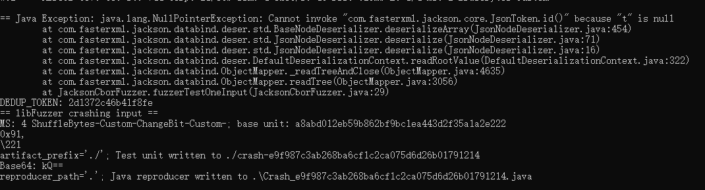

# 漏洞报告
***

## 漏洞概述
* 漏洞类型: 空指针异常（NullPointerException）

* 漏洞描述: 在使用Jazzer工具测试开源的Jackson库时，发现了一个空指针异常（NullPointerException）。该异常表明在解析JSON数据时，某个对象引用为null，导致程序抛出异常。
## jazzer 报错截图

## 详细信息
#### 异常信息:
```
java.lang.NullPointerException: Cannot invoke "com.fasterxml.jackson.core.JsonToken.id()" because "t" is null
at com.fasterxml.jackson.databind.deser.std.BaseNodeDeserializer.deserializeArray(JsonNodeDeserializer.java:454)
at com.fasterxml.jackson.databind.deser.std.JsonNodeDeserializer.deserialize(JsonNodeDeserializer.java:71)
at com.fasterxml.jackson.databind.deser.std.JsonNodeDeserializer.deserialize(JsonNodeDeserializer.java:16)
at com.fasterxml.jackson.databind.deser.DefaultDeserializationContext.readRootValue(DefaultDeserializationContext.java:322)
at com.fasterxml.jackson.databind.ObjectMapper._readTreeAndClose(ObjectMapper.java:4635)
at com.fasterxml.jackson.databind.ObjectMapper.readTree(ObjectMapper.java:3056)
at JacksonCborFuzzer.fuzzerTestOneInput(JacksonCborFuzzer.java:29)
```


#### 异常分析:

* java.lang.NullPointerException: Cannot invoke "com.fasterxml.jackson.core.JsonToken.id()" because "t" is null 表示在调用 JsonToken.id() 方法时，t 对象为null。
* 异常发生在 com.fasterxml.jackson.databind.deser.std.BaseNodeDeserializer.deserializeArray 方法中，该方法负责反序列化JSON数组。
* 异常沿着调用栈传播，最终在 JacksonCborFuzzer.fuzzerTestOneInput 方法中被捕获。
#### 调用栈:
```
at com.fasterxml.jackson.databind.deser.std.BaseNodeDeserializer.deserializeArray(JsonNodeDeserializer.java:454)
at com.fasterxml.jackson.databind.deser.std.JsonNodeDeserializer.deserialize(JsonNodeDeserializer.java:71)
at com.fasterxml.jackson.databind.deser.std.JsonNodeDeserializer.deserialize(JsonNodeDeserializer.java:16)
at com.fasterxml.jackson.databind.deser.DefaultDeserializationContext.readRootValue(DefaultDeserializationContext.java:322)
at com.fasterxml.jackson.databind.ObjectMapper._readTreeAndClose(ObjectMapper.java:4635)
at com.fasterxml.jackson.databind.ObjectMapper.readTree(ObjectMapper.java:3056)
at JacksonCborFuzzer.fuzzerTestOneInput(JacksonCborFuzzer.java:29)
```

## 影响范围
#### 受影响版本: com.fasterxml.jackson.core 2.12.1

#### 潜在影响:

* 程序崩溃：未处理的空指针异常会导致程序崩溃，影响服务的可用性。
* 数据完整性：如果异常发生在数据处理过程中，可能导致数据解析不完整或错误。
## 复现步骤
* 使用Jazzer工具对Jackson库进行模糊测试。
* 提供包含非法或不完整数据的输入，触发反序列化过程。
* 观察程序抛出 java.lang.NullPointerException 异常。
## 修复建议
* 空值检查: 在调用 JsonToken.id() 方法之前，增加空值检查，确保 t 对象不为null。
* 异常处理: 在反序列化过程中捕获并处理 NullPointerException 异常，避免程序崩溃。
* 输入验证: 增加输入数据的验证逻辑，确保数据格式合法，减少异常发生的可能性。
* 库更新: 检查Jackson库的最新版本，查看是否已有相关修复，并考虑升级到最新版本。