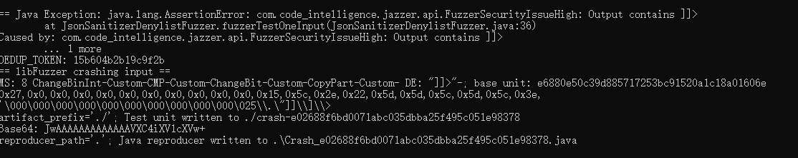

# 漏洞报告
***

## 漏洞概述
* 漏洞类型: 安全问题（FuzzerSecurityIssueHigh）

* 漏洞描述: 在使用Jazzer工具测试开源的JsonSanitizer库时，发现了一个安全问题（FuzzerSecurityIssueHigh）。该问题表明在处理输入时，输出包含非法字符序列 ]]>，这可能会导致安全漏洞。
## jazzer 报错截图

## 详细信息
#### 异常信息:
```
== Java Exception: java.lang.AssertionError: com.code_intelligence.jazzer.api.FuzzerSecurityIssueHigh: Output contains ]]>
        at JsonSanitizerDenylistFuzzer.fuzzerTestOneInput(JsonSanitizerDenylistFuzzer.java:36)
Caused by: com.code_intelligence.jazzer.api.FuzzerSecurityIssueHigh: Output contains ]]>
        ... 1 more
DEDUP_TOKEN: 15b604b2b19c9f2b
== libFuzzer crashing input ==
MS: 8 ChangeBinInt-Custom-CMP-Custom-ChangeBit-Custom-CopyPart-Custom- DE: "]]>"-; base unit: e6880e50c39d885717253bc91520a1c18a01606e
0x27,0x0,0x0,0x0,0x0,0x0,0x0,0x0,0x0,0x0,0x0,0x15,0x5c,0x2e,0x22,0x5d,0x5d,0x5c,0x5d,0x5c,0x3e,
'\000\000\000\000\000\000\000\000\000\000\025\\.\"]]\\]\\>
artifact_prefix='./'; Test unit written to ./crash-e02688f6bd0071abc035dbba25f495c051e98378
Base64: JwAAAAAAAAAAAAAVXC4iXV1cXVw+
reproducer_path='.'; Java reproducer written to .\Crash_e02688f6bd0071abc035dbba25f495c051e98378.java
```


#### 异常分析:

* java.lang.AssertionError: com.code_intelligence.jazzer.api.FuzzerSecurityIssueHigh: Output contains ]]> 表示在处理输入时，输出包含非法字符序列 ]]>。
* 异常发生在 JsonSanitizerDenylistFuzzer.fuzzerTestOneInput 方法中，该方法负责处理输入并进行安全检查。
* 异常沿着调用栈传播，最终在 JsonSanitizerDenylistFuzzer.fuzzerTestOneInput 方法中被捕获。
#### 调用栈:
```
at JsonSanitizerDenylistFuzzer.fuzzerTestOneInput(JsonSanitizerDenylistFuzzer.java:36)
Caused by: com.code_intelligence.jazzer.api.FuzzerSecurityIssueHigh: Output contains ]]>
    ... 1 more
```

## 影响范围
#### 受影响版本: com.mikesamuel:json-sanitizer 1.2.1

#### 潜在影响:

* 安全漏洞: 输出包含非法字符序列 ]]> 可能会导致安全漏洞，影响系统的安全性。
* 数据完整性: 如果异常发生在数据处理过程中，可能导致数据解析不完整或错误。
## 复现步骤
* 使用Jazzer工具对JsonSanitizer库进行模糊测试。
* 提供包含非法或不完整数据的输入，触发JsonSanitizer的处理过程。
* 观察程序抛出 com.code_intelligence.jazzer.api.FuzzerSecurityIssueHigh 异常。
## 修复建议
* 输出验证: 在输出数据之前，增加验证逻辑，确保输出不包含非法字符序列 ]]>。
* 异常处理: 在处理数据过程中捕获并处理 FuzzerSecurityIssueHigh 异常，避免程序崩溃。
* 输入验证: 增加输入数据的验证逻辑，确保数据格式合法，减少异常发生的可能性。
* 库更新: 检查JsonSanitizer库的最新版本，查看是否已有相关修复，并考虑升级到最新版本。

## 为什么输出包含非法字符序列 ]]> 可能会导致安全漏洞？
输出包含非法字符序列 ]]> 可能会导致安全漏洞，主要是因为这种字符序列在某些上下文中具有特殊含义，可能会被误解或滥用。以下是一些具体的原因：

* XML 注释结束标记
在 XML 中，]]> 是用于结束 CDATA（Character Data）段的标记。如果输出包含这个序列，可能会导致 XML 解析器误认为 CDATA 段已经结束，从而导致解析错误或注入攻击。例如：
在这种情况下，XML 解析器会认为 CDATA 段在第一个 ]]> 处结束，后面的 ]]><moredata> 会被当作普通的 XML 内容进行解析，可能导致意外的行为或安全漏洞。
```
<![CDATA[Some data]]>]]><moredata>
```


* XSS（跨站脚本攻击）
在某些情况下，输出包含 ]]> 可能会导致跨站脚本攻击（XSS）。例如，如果一个应用程序将用户输入嵌入到一个 CDATA 段中，而没有正确地进行转义，攻击者可以利用 ]]> 结束 CDATA 段并插入恶意脚本：
这会导致浏览器执行嵌入的脚本，从而进行 XSS 攻击。
```
<![CDATA[Some data]]>]]><script>alert('XSS');</script>
```


* 数据完整性和解析错误
输出包含非法字符序列 ]]> 可能会导致数据解析错误，影响数据的完整性。例如，在处理和存储数据时，如果数据包含未预期的 ]]> 序列，可能会导致数据被截断或解析失败，从而影响系统的正常运行。

* 安全策略绕过
某些安全策略或过滤器可能会依赖于特定的字符序列来检测和阻止恶意输入。如果输出包含 ]]>，可能会绕过这些安全策略或过滤器，从而导致安全漏洞。例如，某些防火墙或入侵检测系统可能会忽略 CDATA 段中的内容，如果攻击者能够插入 ]]>，可能会绕过这些安全措施。

## 解决方案
***

* 输出验证: 在输出数据之前，增加验证逻辑，确保输出不包含非法字符序列 ]]>。
* 转义特殊字符: 在处理用户输入或生成输出时，正确地转义特殊字符，避免它们被误解或滥用。
* 输入验证: 增加输入数据的验证逻辑，确保数据格式合法，减少异常发生的可能性。
* 安全编码实践: 遵循安全编码实践，确保代码在处理和输出数据时不会引入安全漏洞。