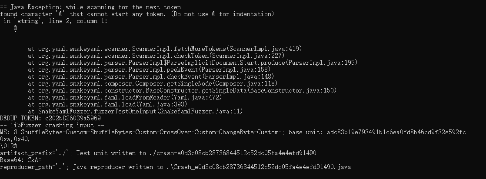

# 漏洞报告
***

## 报错信息
```

== Java Exception: while scanning for the next token
found character '@' that cannot start any token. (Do not use @ for indentation)
 in 'string', line 2, column 1:
    @
    ^

        at org.yaml.snakeyaml.scanner.ScannerImpl.fetchMoreTokens(ScannerImpl.java:419)
        at org.yaml.snakeyaml.scanner.ScannerImpl.checkToken(ScannerImpl.java:227)
        at org.yaml.snakeyaml.parser.ParserImpl$ParseImplicitDocumentStart.produce(ParserImpl.java:195)
        at org.yaml.snakeyaml.parser.ParserImpl.peekEvent(ParserImpl.java:158)
        at org.yaml.snakeyaml.parser.ParserImpl.checkEvent(ParserImpl.java:148)
        at org.yaml.snakeyaml.composer.Composer.getSingleNode(Composer.java:118)
        at org.yaml.snakeyaml.constructor.BaseConstructor.getSingleData(BaseConstructor.java:150)
        at org.yaml.snakeyaml.Yaml.loadFromReader(Yaml.java:472)
        at org.yaml.snakeyaml.Yaml.load(Yaml.java:398)
        at SnakeYamlFuzzer.fuzzerTestOneInput(SnakeYamlFuzzer.java:11)
DEDUP_TOKEN: c202b826039a5969
== libFuzzer crashing input ==
MS: 8 ShuffleBytes-Custom-ShuffleBytes-Custom-CrossOver-Custom-ChangeByte-Custom-; base unit: adc83b19e793491b1c6ea0fd8b46cd9f32e592fc
0xa,0x40,
\012@
artifact_prefix='./'; Test unit written to ./crash-e0d3c08cb28736844512c52dc05fa4e4efd91490
Base64: CkA=
reproducer_path='.'; Java reproducer written to .\Crash_e0d3c08cb28736844512c52dc05fa4e4efd91490.java
```
## jazzer 报错截图

## 漏洞概述
***
**漏洞类型:** 格式错误异常

**漏洞描述:** 在对 SnakeYAML 库进行测试时，发现存在一个格式错误异常。该错误发生在解析 YAML 字符串时，导致程序崩溃

## 异常分析:
***
* 异常信息: found character '@' that cannot start any token. (Do not use @ for indentation) 表示在解析 YAML 字符串时，遇到了非法字符 @，导致扫描器无法继续解析。
* 异常位置: 异常发生在 ScannerImpl.fetchMoreTokens 方法中。
* 传播路径: 异常沿着调用栈传播，最终在 SnakeYamlFuzzer.fuzzerTestOneInput 方法中被捕获。
#### 调用栈:
```
at org.yaml.snakeyaml.scanner.ScannerImpl.fetchMoreTokens(ScannerImpl.java:419)
at org.yaml.snakeyaml.scanner.ScannerImpl.checkToken(ScannerImpl.java:227)
at org.yaml.snakeyaml.parser.ParserImpl$ParseImplicitDocumentStart.produce(ParserImpl.java:195)
at org.yaml.snakeyaml.parser.ParserImpl.peekEvent(ParserImpl.java:158)
at org.yaml.snakeyaml.parser.ParserImpl.checkEvent(ParserImpl.java:148)
at org.yaml.snakeyaml.composer.Composer.getSingleNode(Composer.java:118)
at org.yaml.snakeyaml.constructor.BaseConstructor.getSingleData(BaseConstructor.java:150)
at org.yaml.snakeyaml.Yaml.loadFromReader(Yaml.java:472)
at org.yaml.snakeyaml.Yaml.load(Yaml.java:398)
at SnakeYamlFuzzer.fuzzerTestOneInput(SnakeYamlFuzzer.java:11)
```
## 影响范围
#### 受影响版本: SnakeYAML 1.x 版本

#### 潜在影响:
***
* 程序崩溃: 格式错误异常会导致程序崩溃，影响系统的稳定性。
* 拒绝服务: 攻击者可以通过构造特定的 YAML 字符串，触发该漏洞，导致拒绝服务攻击。

## 复现步骤
***
* 使用模糊测试工具（如 Jazzer）对 SnakeYAML 库进行测试。
* 提供特定的 YAML 字符串输入，触发格式错误异常。
* 观察程序抛出 found character '@' that cannot start any token 异常。
## 修复建议
***
* 输入验证: 在 ScannerImpl.fetchMoreTokens 方法中增加对 YAML 字符串的有效性检查，确保所有字符均符合 YAML 规范。
* 异常处理: 在 YAML 字符串解析过程中，增加异常处理逻辑，确保即使发生异常也不会导致程序崩溃。
* 更新库: 检查 SnakeYAML 库的最新版本，查看是否已有相关修复，并考虑升级到最新版本。
* 安全编码实践: 遵循安全编码实践，确保代码在处理输入数据时不会引入安全漏洞。

## 漏洞原理
**格式错误异常**
格式错误异常
格式错误异常是指在解析输入数据时，遇到了不符合预期格式的数据，导致程序抛出异常。这种错误通常是由于缺乏对输入数据的有效性检查引起的。攻击者可以利用这种漏洞，通过构造恶意输入，导致程序崩溃或拒绝服务。