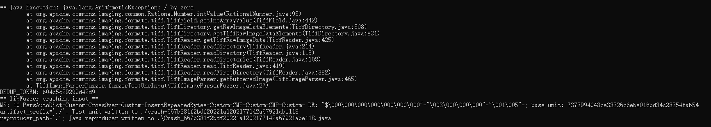

# 漏洞报告
***

## 报错信息
```
== Java Exception: java.lang.ArithmeticException: / by zero
        at org.apache.commons.imaging.common.RationalNumber.intValue(RationalNumber.java:93)
        at org.apache.commons.imaging.formats.tiff.TiffField.getIntArrayValue(TiffField.java:442)
        at org.apache.commons.imaging.formats.tiff.TiffDirectory.getRawImageDataElements(TiffDirectory.java:808)
        at org.apache.commons.imaging.formats.tiff.TiffDirectory.getTiffRawImageDataElements(TiffDirectory.java:831)
        at org.apache.commons.imaging.formats.tiff.TiffReader.getTiffRawImageData(TiffReader.java:425)
        at org.apache.commons.imaging.formats.tiff.TiffReader.readDirectory(TiffReader.java:214)
        at org.apache.commons.imaging.formats.tiff.TiffReader.readDirectory(TiffReader.java:115)
        at org.apache.commons.imaging.formats.tiff.TiffReader.readDirectories(TiffReader.java:108)
        at org.apache.commons.imaging.formats.tiff.TiffReader.read(TiffReader.java:419)
        at org.apache.commons.imaging.formats.tiff.TiffReader.readFirstDirectory(TiffReader.java:382)
        at org.apache.commons.imaging.formats.tiff.TiffImageParser.getBufferedImage(TiffImageParser.java:465)
        at TiffImageParserFuzzer.fuzzerTestOneInput(TiffImageParserFuzzer.java:27)
DEDUP_TOKEN: b04c5c29299d42d9
== libFuzzer crashing input ==
MS: 10 PersAutoDict-Custom-CrossOver-Custom-InsertRepeatedBytes-Custom-CMP-Custom-CMP-Custom- DE: "$\000\000\000\000\000\000\000"-"\003\000\000\000"-"\001\005"-; base unit: 7373994048ce33326c6ebe016bd34c28354fab54
artifact_prefix='./'; Test unit written to ./crash-667b381f2bdf20221a1202177142a67921abe118
reproducer_path='.'; Java reproducer written to .\Crash_667b381f2bdf20221a1202177142a67921abe118.java
```
## jazzer 报错截图


## 漏洞概述
***
**漏洞类型:** 运行时异常

**漏洞描述:** 在对 Apache Commons Imaging 库进行测试时，发现存在一个除零错误。该错误发生在处理 TIFF 图像文件时，导致程序崩溃。

## 异常分析:
***
* java.lang.ArithmeticException: / by zero 表示在进行除法运算时，除数为零。
* 异常发生在 RationalNumber.intValue 方法中。
* 异常沿着调用栈传播，最终在 TiffImageParserFuzzer.fuzzerTestOneInput 方法中被捕获。
#### 调用栈:
```
at org.apache.commons.imaging.common.RationalNumber.intValue(RationalNumber.java:93)
at org.apache.commons.imaging.formats.tiff.TiffField.getIntArrayValue(TiffField.java:442)
at org.apache.commons.imaging.formats.tiff.TiffDirectory.getRawImageDataElements(TiffDirectory.java:808)
at org.apache.commons.imaging.formats.tiff.TiffDirectory.getTiffRawImageDataElements(TiffDirectory.java:831)
at org.apache.commons.imaging.formats.tiff.TiffReader.getTiffRawImageData(TiffReader.java:425)
at org.apache.commons.imaging.formats.tiff.TiffReader.readDirectory(TiffReader.java:214)
at org.apache.commons.imaging.formats.tiff.TiffReader.readDirectory(TiffReader.java:115)
at org.apache.commons.imaging.formats.tiff.TiffReader.readDirectories(TiffReader.java:108)
at org.apache.commons.imaging.formats.tiff.TiffReader.read(TiffReader.java:419)
at org.apache.commons.imaging.formats.tiff.TiffReader.readFirstDirectory(TiffReader.java:382)
at org.apache.commons.imaging.formats.tiff.TiffImageParser.getBufferedImage(TiffImageParser.java:465)
at TiffImageParserFuzzer.fuzzerTestOneInput(TiffImageParserFuzzer.java:27)
```
## 影响范围
#### 受影响版本: org.apache.commons:commons-imaging 1.0-alpha2

#### 潜在影响:
***
* 程序崩溃：除零错误会导致程序崩溃，影响系统的稳定性。
* 安全风险：攻击者可以通过构造特定的 TIFF 文件，触发该漏洞，导致拒绝服务攻击。

## 复现步骤
***
* 使用模糊测试工具（如 Jazzer）对 Apache Commons Imaging 库进行测试。
* 提供特定的 TIFF 文件输入，触发除零错误。
* 观察程序抛出 java.lang.ArithmeticException: / by zero 异常。
## 修复建议
***
* 输入验证: 在 RationalNumber.intValue 方法中增加除数为零的检查，避免进行非法的除法运算。
* 异常处理: 在 TIFF 文件解析过程中，增加异常处理逻辑，确保即使发生异常也不会导致程序崩溃。
* 更新库: 检查 Apache Commons Imaging 库的最新版本，查看是否已有相关修复，并考虑升级到最新版本。
* 安全编码实践: 遵循安全编码实践，确保代码在处理输入数据时不会引入安全漏洞。

## 漏洞原理
**除零错误**
除零错误是指在进行除法运算时，除数为零，导致程序抛出 ArithmeticException 异常。这种错误通常是由于缺乏对输入数据的有效性检查引起的。攻击者可以利用这种漏洞，通过构造恶意输入，导致程序崩溃或拒绝服务。