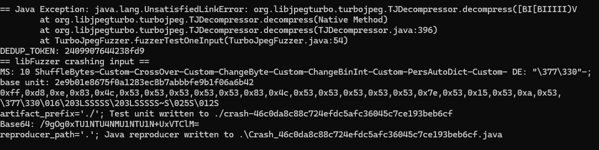

# 漏洞报告

## 报错信息

```
== Java Exception: java.lang.UnsatisfiedLinkError: org.libjpegturbo.turbojpeg.TJDecompressor.decompress([BI[BIIIII)V
        at org.libjpegturbo.turbojpeg.TJDecompressor.decompress(Native Method)
        at org.libjpegturbo.turbojpeg.TJDecompressor.decompress(TJDecompressor.java:396)
        at TurboJpegFuzzer.fuzzerTestOneInput(TurboJpegFuzzer.java:54)
```


## jazzer报错截图




## 漏洞概述

漏洞类型：运行时崩溃

漏洞描述：在对libjpegturbo库进行测试时，发现存在一个格式错误异常。该错误发生在解压缩JPEG图像时，导致程序崩溃。

## 异常分析

decompress方法在TJDecompressor类中用于解压缩JPEG图像。这个方法接收一个字节数组（包含压缩的JPEG图像数据）和一系列其他参数，然后解压缩这个图像数据。  参数的详细解释如下：  
在 TurboJpegFuzzer 类中，主要的测试方法是 fuzzerTestOneInput。这个方法接收一个 FuzzedDataProvider 对象，该对象提供了一系列的方法用于生成随机的测试数据。  在 fuzzerTestOneInput 方法中，首先生成一系列的随机参数，然后使用这些参数调用 TJDecompressor 的 decompress 方法，以测试该方法在处理各种不同输入时的行为。


## 影响范围

#### 受影响版本: libjpegturbo 2.x，1.x 版本

#### 潜在影响:

------

- 程序崩溃: 格式错误异常会导致程序崩溃，影响系统的稳定性。

## 复现步骤

- 使用模糊测试工具（如 Jazzer）对 libjpegturbo  库进行测试。
- 提供特定的输入，触发格式错误异常。
- 观察程序抛出异常

## 修复建议

使用libjpegturbo 3.x版本，在该版本中，实现了对该类方法的重构，将该api舍弃。防止出现解压图片导致的程序崩溃。