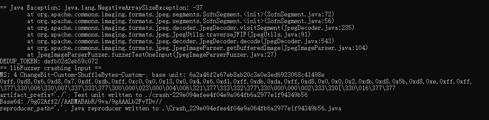

# 漏洞报告
***

## 漏洞概述
* 漏洞类型: java.lang.NegativeArraySizeException

* 漏洞描述: 在使用Jazzer工具对某开源jar包进行模糊测试时，发现了一个java.lang.NegativeArraySizeException异常。该异常通常是由于尝试创建一个大小为负数的数组引起的。
## jazzer 报错截图

## 详细信息
#### 异常信息:
```
== Java Exception: java.lang.NegativeArraySizeException: -37
        at org.apache.commons.imaging.formats.jpeg.segments.SofnSegment.<init>(SofnSegment.java:72)
        at org.apache.commons.imaging.formats.jpeg.segments.SofnSegment.<init>(SofnSegment.java:56)
        at org.apache.commons.imaging.formats.jpeg.decoder.JpegDecoder.visitSegment(JpegDecoder.java:235)
        at org.apache.commons.imaging.formats.jpeg.JpegUtils.traverseJFIF(JpegUtils.java:91)
        at org.apache.commons.imaging.formats.jpeg.decoder.JpegDecoder.decode(JpegDecoder.java:543)
        at org.apache.commons.imaging.formats.jpeg.JpegImageParser.getBufferedImage(JpegImageParser.java:104)
        at JpegImageParserFuzzer.fuzzerTestOneInput(JpegImageParserFuzzer.java:27)
DEDUP_TOKEN: defb02d2eb59c072
== libFuzzer crashing input ==
MS: 4 ChangeBit-Custom-ShuffleBytes-Custom-; base unit: 6a2a46f2a67eb8ab20c3e0e3ed6923068c41498e
0xff,0xd8,0x6,0xd8,0x7,0xdf,0xdb,0xff,0xc0,0x0,0x13,0x0,0x4,0x6,0xd1,0xff,0xdb,0xda,0xff,0xd8,0x0,0x0,0x2,0xdb,0xd8,0x5b,0xd8,0xe,0xff,0xff,
\377\330\006\330\007\337\333\377\300\000\023\000\004\006\321\377\333\332\377\330\000\000\002\333\330[\330\016\377\377
artifact_prefix='./'; Test unit written to ./crash-229e094efee4f04e9a064fb6a2977e1f94349b56
Base64: /9gG2Aff2//AABMABAbR/9va/9gAAALb2FvYDv//
reproducer_path='.'; Java reproducer written to .\Crash_229e094efee4f04e9a064fb6a2977e1f94349b56.java
```


#### 异常分析:

* java.lang.NegativeArraySizeException: -37 表示在尝试创建一个大小为 -37 的数组时发生了异常。
* 异常发生在 org.apache.commons.imaging.formats.jpeg.segments.SofnSegment 类的构造函数中，该构造函数负责处理JPEG图像的SOFN段。
* 异常沿着调用栈传播，最终在 JpegImageParserFuzzer.fuzzerTestOneInput 方法中被捕获。
#### 调用栈:
```
at org.apache.commons.imaging.formats.jpeg.segments.SofnSegment.<init>(SofnSegment.java:72)
at org.apache.commons.imaging.formats.jpeg.segments.SofnSegment.<init>(SofnSegment.java:56)
at org.apache.commons.imaging.formats.jpeg.decoder.JpegDecoder.visitSegment(JpegDecoder.java:235)
at org.apache.commons.imaging.formats.jpeg.JpegUtils.traverseJFIF(JpegUtils.java:91)
at org.apache.commons.imaging.formats.jpeg.decoder.JpegDecoder.decode(JpegDecoder.java:543)
at org.apache.commons.imaging.formats.jpeg.JpegImageParser.getBufferedImage(JpegImageParser.java:104)
at JpegImageParserFuzzer.fuzzerTestOneInput(JpegImageParserFuzzer.java:27)
```

## 影响范围
#### 受影响版本: 1.0-alpha2

#### 潜在影响:

* 程序崩溃：未处理的空指针异常会导致程序崩溃，影响服务的可用性。
* 数据完整性：如果异常发生在数据处理过程中，可能导致数据解析不完整或错误。
## 复现步骤
* 使用Jazzer工具对Apache Commons Imaging库进行模糊测试。
* 提供包含非法或不完整数据的输入，触发JPEG图像解析过程。
* 观察程序抛出 java.lang.NegativeArraySizeException 异常。
## 修复建议
* 边界检查: 在创建数组之前，增加边界检查，确保数组大小为非负数。
* 异常处理: 在处理数据过程中捕获并处理 NegativeArraySizeException 异常，避免程序崩溃。
* 输入验证: 增加输入数据的验证逻辑，确保数据格式合法，减少异常发生的可能性。
* 库更新: 检查Apache Commons Imaging库的最新版本，查看是否已有相关修复，并考虑升级到最新版本。